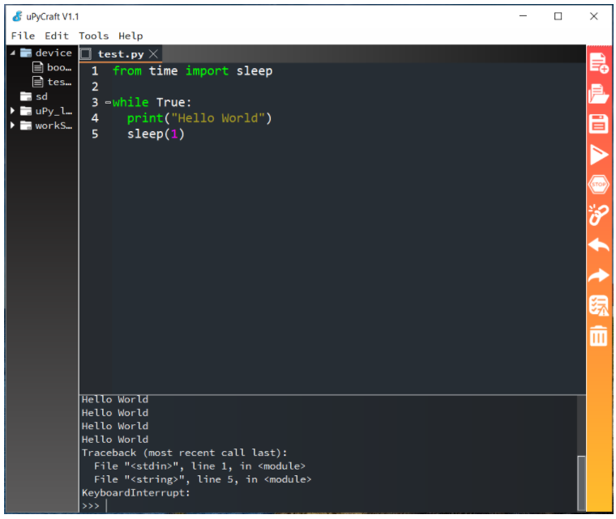

4. Bài học 1: Hello world
====================

Mục tiêu
-----------

Để làm quen với uPyCraft IDE, đầu tiên chúng ta sẽ viết một chương trình cực kỳ đơn giản: in ra dòng chữ ``Hello World``. 

Thiết bị cần sử dụng
-----------

.. image:: images/device-1.png
  :width: 200
  :align: center

Viết chương trình
--------------

Trong uPyCraft, bạn hãy tạo một file chương trình mới (``File > New``) và lưu với tên test.py bằng cách chọn menu ``File > Save…``. Sau đó, bạn copy đoạn code này vào:

.. code-block:: python

  while True:
    print("Hello World")
    time.sleep(1)

*Lưu ý*: Bạn chưa cần hiểu đoạn code ở trên ngay bây giờ nhé. Ở các bài học sau, từng thành phần của một đoạn code trong uPyCraft sẽ được giải thích kỹ hơn.

Bên thanh toolbar bên phải của uPyCraft:

  Nút ``Download`` and Run dùng để chạy và lưu chương trình vào xCon. (Hoặc nhấn F5)

  Nút ``Stop`` dùng để dừng thực thi chương trình.

  .. image:: images/ls-1-8.png
    :width: 600
    :align: center

Bạn hãy thử nhấn nút ``Download and Run`` và chờ cho đến khi nạp thành công (Bạn nhớ kết nối xController với máy bằng cáp USB trước khi Upload nhé).

Ở cửa sổ ``Terminal``, bạn sẽ thấy kết quả chương trình đã thực hiện là:

Dòng chữ “Hello World” được in ra sau mỗi 1 giây:

.. code-block:: python

  >>>
  Ready to download this file,please wait!
  .
  download ok
  Hello World
  Hello World
  Hello World

Chúc mừng bạn đã hoàn thành chương trình đầu tiên trong chuỗi các bài học. Hãy tiếp tục các bài tiếp theo nhé.

*Lưu ý:* Nếu chương trình không thể biên dịch thành công hoặc không thể nạp vào board xController, bạn cần kiểm tra các yếu tố sau:

  - Đảm bảo bạn chọn đúng loại board là esp32 và COM port tương ứng với xController. (Kiểm tra lại trong: ``Tools > Serial > PORT...``)
  - Code nhập vào đúng như code mẫu, không bị thiếu các dấu như ``()``. Bạn có thể mở file code mẫu đi kèm tài liệu và copy vào để đảm bảo code không bị sai sót.
