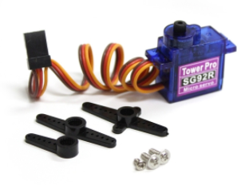
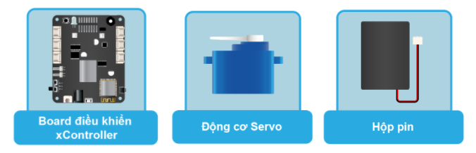
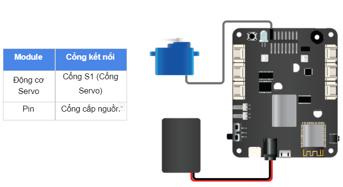

16. Bài học 13: Điều khiển góc quay Servo
====================

Mục tiêu
-----------

Trong bài 3, chúng ta đã tìm hiểu về đọc tín hiệu Analog từ cảm biến xoay để điều chỉnh độ sáng đèn LED. Trong bài học này, chúng ta sẽ sử dụng tín hiệu từ cảm biến xoay để điều khiển góc quay của động cơ Servo 180 độ.

Kiến thức mới
-----------

*Động cơ Servo*

Servo là một dạng động cơ điện đặc biệt. Không giống như động cơ thông thường, cứ cắm điện vào là quay liên tục, Servo chỉ quay khi được điều khiển (bằng xung PPM) với góc quay nằm trong khoảng bất kì từ 0o - 180o. Mỗi loại Servo có kích thước, khối lượng và cấu tạo khác nhau, phù hợp với nhiều ứng dụng khác nhau. 

Bộ xBuild Creator Kit cung cấp sẵn một động cơ Servo loại nhỏ là SG92R.

Thiết bị cần sử dụng
-----------

Lưu ý: Để sử dụng động cơ Servo thì bộ điều khiển xController cần phải được cấp nguồn từ nguồn ngoài (như từ pin) vì nguồn từ USB không đủ điện năng để chạy động cơ. 

Kết nối phần cứng
-----------

Viết chương trình
--------------

  - Mở phần mềm uPyCraft.
  - Tạo một file chương trình mới (``File > New``) và lưu với tên main.py bằng cách chọn menu ``File > Save…``.
  - Copy đoạn code sau, click vào nút ``DownloadAndRun`` để chạy chương trình.

.. code-block:: python

  rotaryvalue = pin41.read_analog()

  while True:
    translate_value = translate(rotaryvalue, 0, 4095, 0, 180)
    servo.position(0, translate_value)

Giải thích chương trình
--------------

.. code-block:: python

  rotaryvalue = pin41.read_analog()

Đặt biến ``rotaryvalue`` là giá trị tín hiệu Analog ở chân IO được chỉ định. Do cảm biến xoay trả về tín hiệu Analog và được kết nối với cổng số 4 trên xController nên ta dùng ``pin41.read_analog()``. Lúc này biến ``rotaryvalue`` sẽ trả về giá trị kiểu số nguyên (``int``) nằm trong khoảng từ ``0 đến 4095``. Tuy nhiên, hàm ``servo.positon()`` chỉ nhận giá trị từ ``0 đến 180`` (độ), trong khi cảm biến xoay có giá trị từ ``0 đến 4095``, nên ta cần quy đổi các khoảng giá trị này bằng hàm ``translate``.

.. code-block:: python

  translate_value = translate(rotaryvalue, 0, 4095, 0, 180)

Hàm ``servo.position()`` có cấu trúc như sau:

.. code-block:: python

  servo.position(index, angle)

Các tham số sử dụng:

  - ``index``: Số thứ tự của cổng kết nối đến Servo, từ 0 (S1) đến 7 (S8).
  - ``Angle``: Góc cần quay, từ 0 đến 180 độ.

Sau khi nạp chương trình vào board, bạn xoay biến trở sẽ thấy sự thay đổi về góc của servo. 
