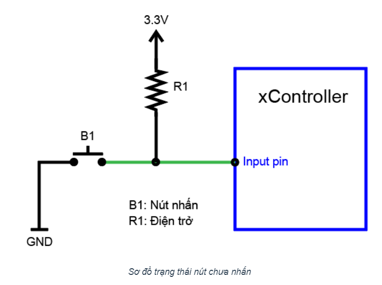
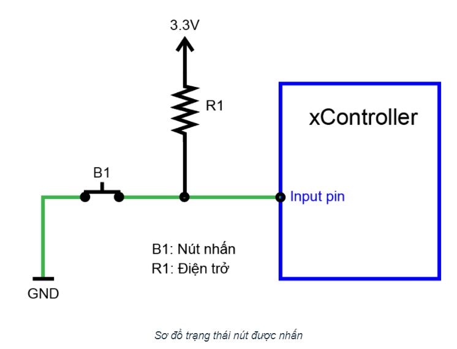
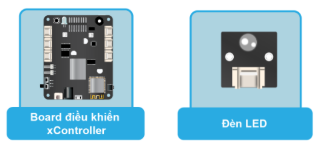
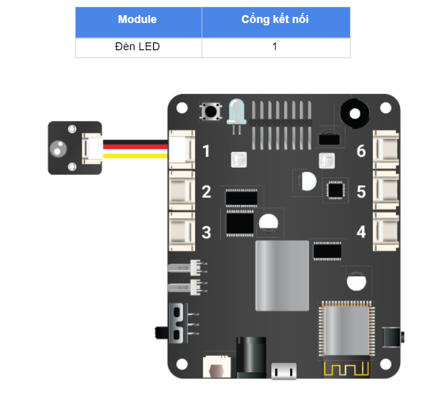

6. Bài học 3: Nhấn nút bật đèn LED
====================

Mục tiêu
-----------

Trong bài học này, bạn sẽ tìm hiểu về tín hiệu ``Digital Input`` và học cách điều khiển đèn LED bằng nút nhấn, thay vì tự động bật tắt LED đơn giản như trong bài học trước.

Kiến thức mới
-----------

*Tín hiệu Digital Input*

Ngược với tín hiệu ``Digital Output`` là tín hiệu ``Digital Input``. Bạn sẽ dùng ``Digital Input`` khi chân IO nối với các module xuất tín hiệu HIGH (3.3V) hoặc LOW (0V), ví dụ như nút nhấn.

Để biết khi nút được nhấn là ``HIGH`` hay ``LOW``, chúng ta cần tìm hiểu thiết kế của module nút nhấn mà chúng ta đang sử dụng. Sơ đồ thiết kế của module nút nhấn:

Ta thấy, chân tín hiệu đầu ra của nút nhấn được nối với input pin của xController (đường màu xanh lá). 

Ở trạng thái bình thường chưa được nhấn, chân tín hiệu này được nối với nguồn điện dương 3.3V thông qua một điện trở R1, khi đó, tín hiệu này có giá trị là HIGH (3.3V).

Khi nút được nhấn, mạch đóng lại, chân tín hiệu này được nối thẳng với nguồn điện âm (GND, Ground) thay vì 3.3V (do điện trở R1 cản trở) nên tín hiệu sẽ có giá trị là LOW (0V).

Kiểu thiết kế như trên còn được gọi là Input Pullup (điện trở kéo lên 3.3V). Một kiểu thiết kế khác ngược lại là Input Pulldown, có sơ đồ như sau:

.. image:: images/ls-3-3.png
  :width: 500
  :align: center

Với thiết kế này, chân IO tín hiệu mặc định khi chưa nhấn nút sẽ được nối với GND (đường màu xanh lá) và có giá trị ở mức LOW (0V). Khi nút được nhấn, chân IO sẽ được nối thẳng lên 3.3V và có giá trị là HIGH. Khi làm việc với các module, bạn cần hiểu rõ cách thiết kế của chúng, từ đó chọn cách xử lý đúng tín hiệu trả về.

Thiết bị cần sử dụng
-----------

Kết nối phần cứng
-----------

Cả LED và nút nhấn đều sử dụng tín hiệu ``Digital``, nên 2 module này sẽ được kết nối với cổng giao tiếp ``Digital``.

Viết chương trình
--------------

  - Mở phần mềm uPyCraft.
  - Tạo một file chương trình mới (``File > New``) và lưu với tên main.py bằng cách chọn menu ``File > Save…``.
  - Copy đoạn code sau, click vào nút ``DownloadAndRun`` để chạy chương trình.

.. code-block:: python

  while True:
    if (btn_onboard.is_pressed()):
      pin11.write_digital(1)
    else:
      pin11.write_digital(0)

Giải thích chương trình
--------------

Để xử lý tín hiệu đọc được, đoạn code này sử dụng một cú pháp rất phổ biến trong lập trình là câu lệnh kiểm tra điều kiện ``if…else...``. Câu lệnh điều kiện cho phép chúng ta kiểm tra một điều kiện là đúng hay sai, và tùy theo kết quả đúng sai mà những khối lệnh liên quan sẽ được thực hiện.

Câu lệnh ``if...else…`` có cú pháp đầy đủ như sau:

.. code-block:: python

  if condition1:
      # do Thing A
  elif condition2:
      # do Thing B
  else:
      # do Thing C

Ở cú pháp trên, chương trình sẽ kiểm tra điều kiện ``condition1`` đầu tiên: 

  - Nếu ``condition1`` đúng: thực hiện các dòng lệnh trong phần “do Thing A”
  - Nếu ``condition1`` sai: chương trình sẽ tiếp tục kiểm tra điều kiện condition2:

    - Nếu ``condition 2`` đúng, thực hiện các lệnh trong nhóm “do Thing B. 
    - Nếu ``condition 2 ``sai, chương trình sẽ thực hiện các lệnh trong nhóm cuối cùng là “do Thing C”.

Có thể sử dụng nhiều hơn 1 điều kiện trong câu lệnh ``if... else…``

.. code-block:: python

  btn_onboard.is_pressed()

Câu lệnh này lấy giá trị hiện tại của nút nhấn trên board.

Kết quả trả về là:

  - ``True``: Khi nút được nhấn
  - ``False``: Khi nút không được nhấn.

Theo đó, trong chương trình bật tắt đèn LED ở trên, chương trình sẽ kiểm tra xem kết quả trạng thái nút nhấn có là ``True`` (nút được nhấn) hay không. Nếu trạng thái của nút nhấn đang là True, đèn LED sẽ được bật và ngược lại (trạng thái ở mức HIGH, nút không được nhấn), đèn LED sẽ tắt.

Bạn hãy thử chạy chương trình, nhấn nút và quan sát kết quả đèn LED.
