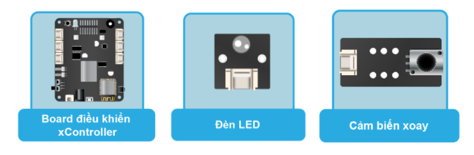
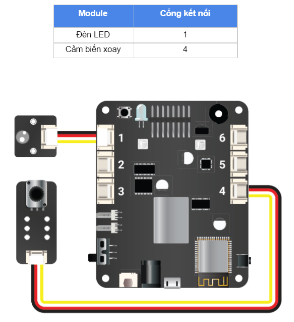

Bài học 5: Điều chỉnh độ sáng LED
====================

Mục tiêu
-----------

Trong bài học trước, chúng ta đã tìm hiểu về đọc tín hiệu Analog từ cảm biến xoay. Ngoài ra, chúng ta cũng có thể xuất ra tín hiệu Analog thay vì chỉ xuất ra tín hiệu bật tắt bằng các trạng thái HIGH và LOW. Một số ví dụ: điều chỉnh độ sáng đèn LED, thay đổi tốc độ quay nhanh hay chậm của động cơ, cho âm thanh của loa to nhỏ theo ý muốn,…

Trong bài học này, chúng ta sẽ sử dụng tín hiệu Analog Output để tăng giảm độ sáng của đèn LED bằng giá trị của cảm biến xoay.

Kiến thức mới
-----------

*PWM (Pulse Width Modulation)*

Trên thực tế, chip điều khiển không thể xuất ra được tín hiệu Analog thật mà chỉ có thể xuất ra tín hiệu ``HIGH`` (bật) và ``LOW`` (tắt). ``PWM`` là một cách thức thông minh mà chip điều khiển dùng để xuất ra tín hiệu Analog. ``PWM`` hoạt động như sau:

  - ``PWM`` chia thời gian thành các chu kỳ ngắn. Tần số (frequency, đơn vị là Hz) là số chu kỳ trong 1 giây.
  - *Ví dụ*: Giả sử ta chia ra mỗi chu kỳ kéo dài là 0,1 giây (100 mili giây). Khi đó, tần số sẽ bằng:
    ``frequency = 1 / 0,1 = 10 (Hz)``

  Trong trường hợp này, tần số là 10 chu kỳ trong 1 giây (10Hz).
  - ``PWM`` sẽ bật tắt liên tục trong mỗi chu kỳ này và lặp lại giống nhau ở tất cả các chu kỳ. Độ mạnh yếu của tín hiệu ``Analog`` được quyết định bởi tổng số thời gian bật trên tổng thời gian của chu kỳ (gọi là ``duty cycle``).

Ví dụ sau sẽ giúp bạn hiểu rõ hơn: Cho thời gian một chu kỳ là ``100 mili giây``, tần số ``10Hz``:

  - Nếu ta muốn đèn LED chỉ sáng 25% so với mức tối đa (mức HIGH) thì PWM sẽ chỉ bật tín hiệu trong suốt 25% thời gian của chu kỳ (25 milli giây) và tắt trong 75% thời gian còn lại.
  - Nếu ta muốn đèn LED chỉ sáng 50% thì ``PWM`` sẽ bật tín hiệu trong suốt 50% thời gian của chu kỳ (50 mili giây) và tắt trong 50% thời gian còn lại.

  .. image:: images/ls-5-1.png
    :width: 600
    :align: center

*Lưu ý*: xController có 16 kênh ``PWM`` độc lập (đánh số từ ``0-15``). Mỗi kênh này có thể cấu hình để sử dụng với tần số và Duty Cycle khác nhau.

Thiết bị cần sử dụng
-----------

Kết nối phần cứng
-----------

Viết chương trình
--------------

  - Mở phần mềm uPyCraft.
  - Tạo một file chương trình mới (``File > New``) và lưu với tên main.py bằng cách chọn menu ``File > Save…``.
  - Copy đoạn code sau, click vào nút ``DownloadAndRun`` để chạy chương trình.

.. code-block:: python

  rotaryvalue = pin41.read_analog()

  while True:
    translate_value = translate(rotaryvalue, 0, 4095, 0, 1023)
    pin11.write_analog(translate_value)

Giải thích chương trình
--------------

.. code-block:: python

  rotaryvalue = pin41.read_analog()

Đặt biến ``rotaryvalue`` là giá trị tín hiệu Analog ở chân IO được chỉ định. Do cảm biến xoay trả về tín hiệu Analog và được kết nối với cổng số 4 trên xController nên ta dùng ``pin41.read_analog()``. Lúc này biến ``rotaryvalue`` sẽ trả về giá trị kiểu số nguyên (``int``) nằm trong khoảng từ 0 đến 4095.

Tuy nhiên, hàm ``pin[X][Y].write_analog`` chỉ nhận giá trị từ 0 đến 1023, trong khi cảm biến xoay có giá trị từ 0 đến 4095, nên ta cần quy đổi các khoảng giá trị này bằng hàm translate sau đây:

.. code-block:: python

  translate_value = translate(rotaryvalue, 0, 4095, 0, 1023)

Ta sẽ gán giá trị quy đổi bằng biến ``translate_value``.

Hàm ``translate()`` có cấu trúc đầy đủ như sau:

.. code-block:: python
  
  translate(value, min_in, max_in, min_out, max_out)

Hàm ``translate`` sẽ quy đổi khoảng giá trị ban đầu thành khoảng giá trị khác mà chúng ta cần. Trong đó:

  - value  là giá trị cần quy đổi.
  - min_in là giá trị đầu vào nhỏ nhất.
  - max_in là giá trị đầu vào lớn nhất.
  - min_out là giá trị ra vào nhỏ nhất.
  - max_out là giá trị ra vào lớn nhất.

.. image:: images/ls-4-3.png
  :width: 320
  :align: center

Xuất giá trị analog ở PORT 4 với giá trị cần xuất ra là kết vừa quy đổi ở trên (``translate_value``)

.. code-block:: python

  pin41.write_analog(translate_value)

Lệnh khởi tạo một ``Object Pin Analog Write`` đầy đủ như sau:

.. code-block:: python

  pin[X][Y].write_digital((STATE))

Trong đó:

  - ``X`` Có giá trị từ 4 ~ 6 đại diện PORT 4 đến PORT 6 của xController.
  - ``Y`` Có giá trị là 1 hoặc 2 tương ứng với 2 đường tín hiệu logic đối với mỗi PORT. Đối với một số module output thì mặc định là 1.
  - ``STATE`` Có giá trị là 0 ~ 1023 tương ứng mức điện áp 0 ~ 3.3 volt

Sau khi nạp chương trình vào board, bạn xoay biến trở sẽ thấy sự thay đổi về độ sáng của đèn LED. 
