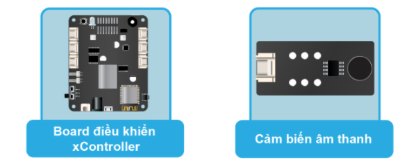

10. Bài học 7: Vỗ tay thay đổi màu đèn LED
====================

Mục tiêu
-----------

Tìm hiểu về cảm biến âm thanh và ứng dụng vào bật tắt đèn LED RGB tích hợp trên xController.

Kiến thức mới
-----------

*Cảm biến âm thanh*

Cảm biến âm thanh có thể dùng để phát hiện và đo cường độ âm thanh của môi trường xung quanh. Chúng ta có thể ứng dụng cảm biến này để điều khiển đèn LED RGB bằng tiếng vỗ tay. 

Thiết bị cần sử dụng
-----------

Kết nối phần cứng
-----------

Viết chương trình
--------------

  - Mở phần mềm uPyCraft.
  - Tạo một file chương trình mới (``File > New``) và lưu với tên main.py bằng cách chọn menu ``File > Save…``.
  - Copy đoạn code sau, click vào nút ``DownloadAndRun`` để chạy chương trình.

.. code-block:: python

  led_state = 0
  sound_value = pin41.read_analog()
  while True:
    print(sound_value) # In giá trị cảm biến âm thanh
    if sound_value > 1000:
      led_state = 1 - led_state
      time.sleep(0.3)
    if led_state == 0:
      led_onboard.show(0, (0, 0, 0))
    else:
      led_onboard.show(0, (255, 0, 0))
    time.sleep(1)

Sau khi nạp chương trình, Bạn có thể xem giá trị của cảm biến âm thanh trong cửa sổ Terminal.

Giải thích chương trình
--------------

Các câu lệnh khai báo đối tượng XController và các biến sẽ tương tự như các bài trước. Tuy nhiên, chúng ta cần để ý đoạn code đảo trạng thái của đèn LED RGB như sau:

.. code-block:: python

  # nếu giá trị cảm biến lớn hơn 1000 thì đảo trạng thái bật tắt của đèn LED
  if sound_value > 1000:
      led_state = 1 - led_state
      time.sleep(0.3)

Câu lệnh if sẽ kiểm tra kết quả đo được có lớn hơn 1000 hay không, nếu có thì mới đảo trạng thái đèn LED. Giá trị 1000 ở đây gọi là ngưỡng, do chúng ta tự đo và ấn định. Trong trường hợp này, nếu chúng ta để ngưỡng càng nhỏ thì chương trình sẽ chạy càng nhạy.

.. code-block:: python

  led_state = 1 - led_state

Đảo trạng thái LED (``led_state``) đơn giản từ 0 thành 1 hoặc từ 1 thành 0: Nếu ``led_state`` đang có giá trị là 0 thì ``led_state`` mới bằng 1 - 0, sẽ thành 1. Ngược lại, nếu ``led_state`` đang là 1 thì ``led_state`` mới (= 1 - 1) sẽ thành 0.

.. code-block:: python

  time.sleep(0.3)

Sau khi xử lý xong, chúng ta cần phải tạm dừng chương trình trong một thời gian ngắn để tránh trường hợp do chương trình chạy quá nhanh, lúc đó tiếng động truyền vào kéo dài chưa kịp dứt thì sẽ bị xử lý nhiều lần, tạo ra kết quả bật tắt không mong muốn.

.. code-block:: python

  # bật tắt đèn LED RGB dựa vào trạng thái đã được xử lý
  if led_state == 0:
      led_onboard.show(0, (0, 0, 0))
    else:
      led_onboard.show(0, (255, 0, 0))

Cuối vòng lặp, chúng ta sẽ dùng cấu trúc if else để bật tắt đèn LED, tùy vào giá trị của biến ``led_state``. Hàm để bật tắt LED RGB (thực chất là thay đổi màu vì ta chỉ sử dụng màu đỏ) là hàm ``led_onboard.show()`` đã được giải thích ở bài học trước.

Khi chương trình chạy, đèn LED sẽ thay đổi màu nếu phát hiện âm thanh của môi trường xung quanh đủ lớn.
