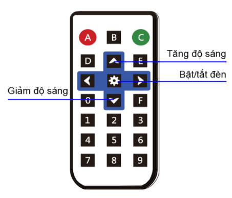

Project 1: Đèn điều khiển từ xa
====================

Mục tiêu
-----------

Bạn vừa lên giường trùm chăn ấm và chợt nhận ra là quên chưa tắt đèn, hay bạn băn khoăn không biết vừa nãy đã tắt điện phòng tắm chưa. Nếu ở trong những tình huống này, bạn sẽ làm gì? 

Sẽ rất thuận tiện nếu bạn có thể bật tắt đèn từ xa bằng remote phải không nào? Ngoài ra, không chỉ là bật tắt, chúng ta sẽ dùng remote để điều chỉnh độ sáng đèn phù hợp cho nhiều hoàn cảnh sử dụng như đọc sách, xem phim hay khi chuẩn bị đi ngủ.

Trong dự án này, chúng ta sẽ dùng đèn LED RGB có trên hộp điều khiển xController để mô phỏng đèn trong nhà và sử dụng remote hồng ngoại để có thể:

  - Tăng giảm độ sáng bằng 2 phím ``lên`` và ``xuống``. Mỗi lần tăng giảm 25% độ sáng.
  - Bật hoặc tắt đèn LED bằng phím ``Setup``

Thiết bị cần sử dụng
-----------

.. image:: images/project-1-2.png
  :width: 420
  :align: center

Viết chương trình
--------------

  - Mở phần mềm uPyCraft.
  - Tạo một file chương trình mới (``File > New``) và lưu với tên main.py bằng cách chọn menu ``File > Save…``.
  - Copy đoạn code sau, click vào nút ``DownloadAndRun`` để chạy chương trình.

.. code-block:: python

  from ir_receiver import *; ir_rx.start();

  while True:
    if ir_rx.get_code() == IR_REMOTE_UP:
      light_level = light_level + 50
      if light_level > 255:
        light_level = 255
      ir_rx.clear_code()
    elif ir_rx.get_code() == IR_REMOTE_DOWN:
      light_level = light_level - 50
      if light_level < 0:
        light_level = 0
      ir_rx.clear_code()
    elif ir_rx.get_code() == IR_REMOTE_SETUP:
      if light_level > 0:
        light_level = 0
      else:
        light_level = 255
      ir_rx.clear_code()
    led_onboard.show(0, (light_level, 0, 0))
    time.sleep(0.2)

Giải thích chương trình
--------------

Chương trình sử dụng các lệnh đã học ở những bài học trước về remote và đèn LED RGB. Chúng ta dùng biến tên ``light_level`` (có kiểu là int) để lưu độ sáng hiện tại của đèn LED và thay đổi độ sáng tùy vào phím được nhấn.