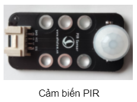
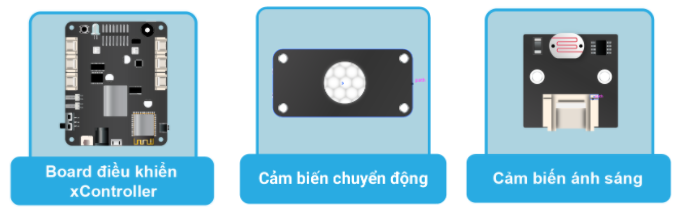
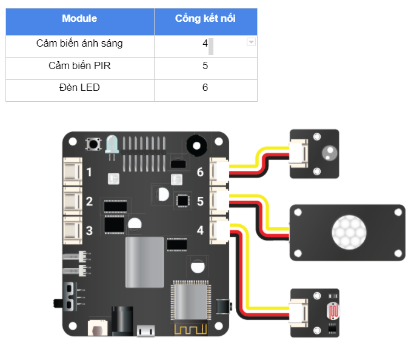

20. Project 3: Đèn thông minh
====================

Mục tiêu
-----------

Trong một ngôi nhà, nếu đèn có thể tự bật một cách thông minh khi có người hoặc khi trời bắt đầu tối thì sẽ rất thuận tiện đấy. Một số ví dụ phổ biến là đèn ngoài cửa khi ta đi về nhà hoặc đèn cầu thang khi ta đi lên xuống buổi tối.

Trong bài này, chúng ta cùng nhau làm một đèn ngoài cửa nhà thông minh với các tính năng sau:

  - Tự động bật đèn khi phát hiện chuyển động hoặc khi trời đang tối
  - Tự động tắt sau 15 giây

Để phát hiện được có người, chúng ta sẽ dùng một cảm biến mới là cảm biến phát hiện chuyển động bằng hồng ngoại (``Passive Infrared``, gọi tắt là ``PIR``). 

Khi phát hiện có chuyển động, chân tín hiệu của module sẽ được bật ở mức ``HIGH``. Bình thường, chân tín hiệu này sẽ ở mức ``LOW``.

Thiết bị cần sử dụng
-----------

Kết nối phần cứng
-----------

Viết chương trình
--------------

  - Mở phần mềm uPyCraft.
  - Tạo một file chương trình mới (``File > New``) và lưu với tên main.py bằng cách chọn menu ``File > Save…``.
  - Copy đoạn code sau, click vào nút ``DownloadAndRun`` để chạy chương trình.

.. code-block:: python

  lightsensorvalue = 0
  pirstate = 0
  ledstate = 0
  ledontime = 0

  while True:
    lightsensorvalue = pin41.read_analog()
    pirstate = pin51.read_digital()
    if pirstate == 1 and lightsensorvalue < 200:
      pin61.write_digital((1))
      ledontime = ticks_ms
      ledstate = 1
    currentmillis = ticks_ms
    if ledstate == 1 and currentmillis - ledontime >= 10000:
      pin61.write_digital((0))
      ledontime = 0
      ledstate = 0

Giải thích chương trình
--------------

Trong chương trình trên, chúng ta sẽ sử dụng các hàm đơn giản đã học là ``read_digital()`` để đọc tín hiệu Digital từ cảm biến PIR và hàm ``read_analog()`` để đọc giá trị cảm biến ánh sáng. Sau đó, chương trình kiểm tra điều kiện có phát hiện sự chuyển động và trời có đang tối không để bật đèn.

Sau khi bật đèn, chúng ta sử dụng cách thức đo thời gian như trong project 2 để biết đến lúc phải tắt đèn (sau 10 giây tính từ lúc bật đèn).
