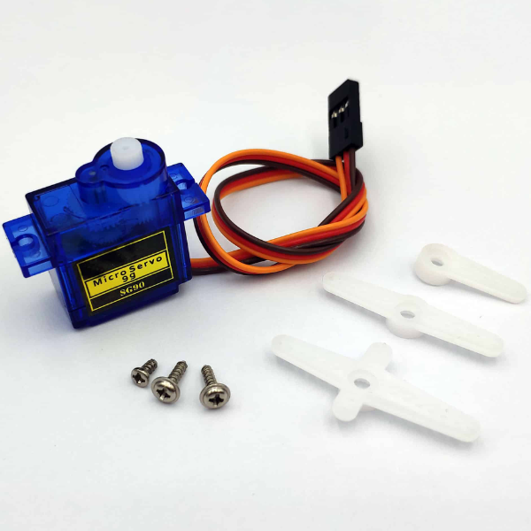
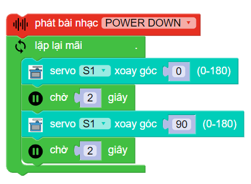
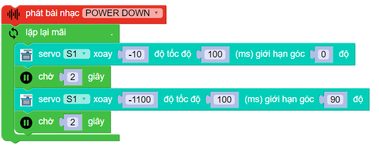

**Đầu nâng ForkLift**
============================

1. Giới thiệu 
----------
-----------

Đầu nâng ForkLift là phụ kiện gắn vào xBot, giúp nâng hoặc thả đồ vật tùy thích.

.. raw:: html

 <iframe width="560" height="315" src="https://www.youtube.com/embed/uYxYTgH4vQE" title="YouTube video player" frameborder="0" allow="accelerometer; autoplay; clipboard-write; encrypted-media; gyroscope; picture-in-picture" allowfullscreen></iframe>

| 

2. Link sản phẩm 
-------
------------

..  image:: images/gio.png
    :alt: some image
    :target: https://ohstem.vn/product/dau-nang/
    :class: with-shadow
    :scale: 100%
    :align: center
|

3. Hướng dẫn lập trình 
----
-------

Để đầu nâng ForkLift có thể thực hiện được nhiệm vụ, chúng ta cần sử dụng động cơ servo SG90S. 

Động cơ servo có thể thực hiện được lệnh xoay cánh tay động cơ đến vị trí được lập trình sẵn (từ 0 đến 180 độ) một cách tức thời hoặc theo một tốc độ cho trước.

| 

Chiều xoay của động cơ servo là hướng khi chúng ta quan sát trực diện với mặt trục xoay. Theo quy ước, chiều xoay từ phải sang trái tức ngược chiều kim đồng hồ của động cơ servo sẽ tính từ góc 0 độ đến 180 độ.

Servo SG90S có 3 dây tín hiệu như sau:

    + Dây nâu: cấp nguồn âm

    + Dây đỏ: Cấp nguồn dương (3.3-6 vôn DC)

    + Dây cam: dây tín hiệu điều khiển.

**Giới thiệu khối lệnh:**

Trong danh mục khối lệnh **Di chuyển**, sử dụng 2 khối lệnh sau để điều khiển servo của đầu nâng:

    Điều khiển động cơ servo 180 độ quay tới 1 góc nào đó từ 0-180.
|

    Điều khiển tốc độ và góc quay của động cơ servo 180.
|

.. note:: Trên xBot, có 8 cổng kết nối để điều khiển servo. Khi lập trình bạn cần chọn đúng cổng đã kết nối!

**Viết chương trình điều khiển đầu nâng:**

- Bạn có thể lập trình cho xBot nâng lên 2 giây sau đó hạ xuống 2 giây lặp lại bằng lệnh : 

| 

- Hoặc bạn cũng có thể lập trình cho robot nâng hạ chậm hơn bằng lệnh:

| 
