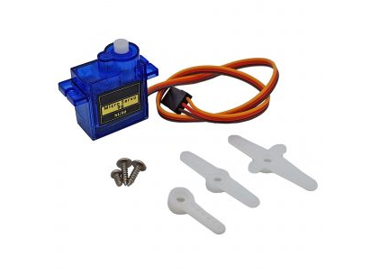
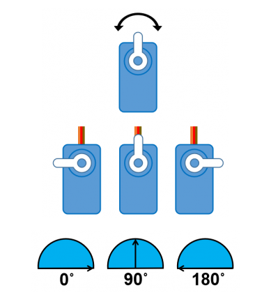
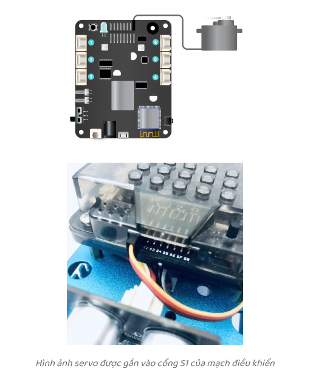
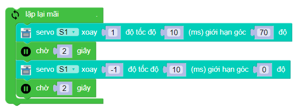
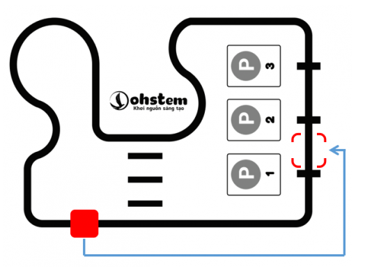
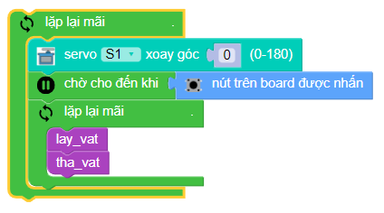
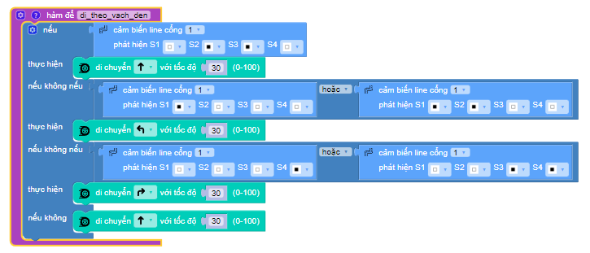
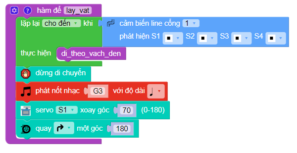
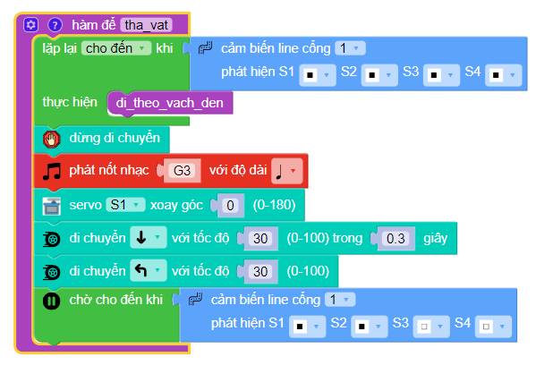

**Đầu gắp Gripper**
===========================

1. Giới thiệu
----------
----------

Đầu gắp Gripper có thể được sử dụng để gắn vào robot lập trình xBot. Bộ phận này có thể gắp và di chuyển đồ vật dễ dàng.

.. raw:: html

 <iframe width="560" height="315" src="https://www.youtube.com/embed/l9Vba8oYV9Q" title="YouTube video player" frameborder="0" allow="accelerometer; autoplay; clipboard-write; encrypted-media; gyroscope; picture-in-picture" allowfullscreen></iframe>

2. Link sản phẩm 
-------
------------

..  image:: images/gio.png
    :alt: some image
    :target: https://shop.ohstem.vn/san-pham/dau-gap-robot/
    :class: with-shadow
    :scale: 100%
    :align: center
|

3. Hướng dẫn lắp ráp
-----------------
-----------------

    .. image:: images/gripper_1.png
        :width: 900px
        :align: center  

    .. image:: images/gripper_2.png
        :width: 900px
        :align: center 

    .. image:: images/gripper_3.png
        :width: 900px
        :align: center  

    .. image:: images/gripper_4.png
        :width: 900px
        :align: center 

    .. image:: images/gripper_5.png
        :width: 900px
        :align: center 

  .. image:: images/gripper_6.png
        :width: 900px
        :align: center 

 .. image:: images/gripper_7.png
        :width: 900px
        :align: center 

 .. image:: images/gripper_8.png
        :width: 900px
        :align: center 

 .. image:: images/gripper_9.png
        :width: 900px
        :align: center 

 .. image:: images/gripper_10.png
        :width: 900px
        :align: center 

 .. image:: images/gripper_11.png
        :width: 900px
        :align: center 

4. Hướng dẫn lập trình
------------------
------------------

Để Gripper có thể thực hiện được nhiệm vụ, chúng ta cần sử dụng động cơ servo sg90 nhé!

Động cơ servo có thể thực hiện được lệnh xoay cánh tay động cơ đến vị trí được lập trình sẵn (từ 0 đến 180 độ) một cách tức thời hoặc theo một tốc độ cho trước.

|   
Chiều xoay của động cơ servo là hướng khi chúng ta quan sát trực diện với mặt trục xoay. Theo quay ước, chiều xoay từ phải sang trái tức ngược chiều kim đồng hồ của động cơ servo sẽ tính từ góc 0 độ đến 180 độ.

|   
Servo sg90 có 3 dây tín hiệu như sau:

1. Dây nâu: cấp nguồn âm

2. Dây đỏ: Cấp nguồn dương (3.3-6 vôn DC)

3. Dây cam: dây tín hiệu điều khiển.

**Viết chương trình điều khiển**

Đầu tiên hãy lắp tay gắp xBot và kết nối dây servo vào như hình bên dưới.

|   
Ví dụ 1: Điều khiển đóng mở tay gắp nhanh

|   
Trong ví dụ trên, ta sử dụng khối lệnh sau:

|   
Điều khiển động cơ servo 180 độ quay tới một góc nào đó tức thời. Trong đó:

- Vị trí đầu tiên tương ứng với 8 cổng gắn servo trên mạch điều khiển.

- degree là tham số góc quay của servo có giá trị 0 đến 180 độ.

Ví dụ 2: Điều khiển đóng mở tay gắp từ từ

|   
Trong ví dụ trên, ta sử dụng khối lệnh sau:

|   
Điều khiển động cơ servo 180 độ quay tới một góc tới hạn degree với thời gian nghỉ sleep sau mỗi bước di chuyển change. Trong đó:

- Vị trí đầu tiên tương ứng với 8 cổng gắn servo trên mạch điều khiển.

- change là tham số 1 bước di chuyển tới góc mới của servo. Là giá trị số có giá trị từ 0 đến (degree/change). change có giá trị càng nhỏ thì servo chuyển bước cằng mượt.

- sleep là thời gian nghỉ giữa mỗi bước change có đơn vị là mili giây.

- degree là tham số góc quay tới hạn của servo có giá trị 0 ~ 180 độ.

**Thực hành robot di chuyển đồ vật**

|   

Ở bài trước, chúng ta đã tìm hiểu cách để lập trình cho robot đi theo vạch đen. Bây giờ chúng ta sẽ dựa vào chương trình đó và kết hợp thêm tay gắp, khi phát hiện có vật cản thì gắp vật, sau đó quay lại và tìm vạch đen gần nhất để thả vật. Sau đó là quay lại vị trí ban đầu để tìm thêm vật cản.

Và quá trình này lặp đi lặp lại tương tự như các dây chuyền trong quy trình sản xuất, và khi đó nhờ vào sự phát triển của những ứng dụng robot thế này mà chúng ta sẽ giảm đi rất nhiều nhân lực, sức lực và thời gian sản xuất.

Và đầu tiên, chúng ta sẽ giải quyết bài toán như sau:

1. Cho robot đi theo vạch đen

2. Khi cảm biến siêu âm phát hiện vật cản thì gặp vật > quay 180 độ > đi theo vạch đen

3. Khi cảm biến vật cản phát hiện vạch đen gần nhất thì thả vật > quay 180 độ > đi theo vạch đen

Quá trình trên thực hiện mãi cho đến khi nào chúng ta dừng robot.

Chương trình mẫu:

|   

|   

|   

|   
Giải thích chương trình

Ở chương trình này, ta sẽ sử dụng các hàm nhỏ để dễ dàng quản lý tác vụ cho robot. Chúng ta có 3 hàm chính như sau:

Hàm **di_theo_vach_den()**

|   
Đối với hàm này, các bạn xem lại bài hướng dẫn về cách thực hiện robot đi theo line để tìm hiểu thêm nhé.

Hàm **lay_vat()**

|   
Nếu cảm biến siêu âm của robot chưa phát hiện vật cản thì robot vẫn thực hiện hàm di_theo_vach_den()

Nếu phát hiện vật thì:

- Dừng robot

- Gắp vật

- Phát âm thanh thông báo

- Quay 180 độ rồi trở lại đường đi

Hàm **tha_vat()**

|   
Nếu robot chưa phát hiện vạch đen thì robot vẫn thực hiện hàm di_theo_vach_den()

Nếu robot phát hiện vạch đen thì

- Dừng robot

- Thả vật

- Phát âm thanh thông báo

- Lui lại 1 khoảng để khi xoay không vướng vật

- Quay qua trái cho tới khi trở lại đường đi

Và cuối cùng, trong vòng lặp chính, ta chỉ cần gọi hàm lay_vat() và tha_vat() là hoàn tất:

Các bạn có thể tải chương trình mẫu tại đây. Chúc các bạn thực hiện thành công!

|   
