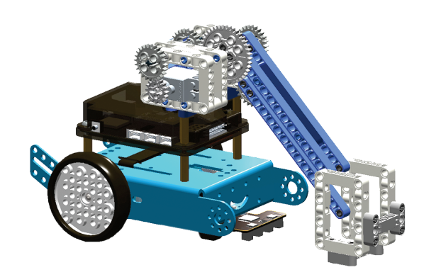
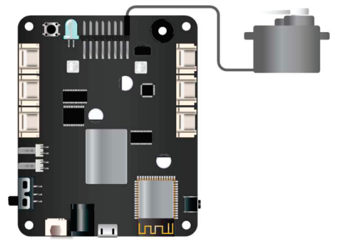

11. Xe cứu hộ
===========================

|   
Trước khi lắp ráp, bạn cần chỉnh động cơ Servo về đúng góc. 

Vào OhStem App > Chọn thiết bị xBot > Mở rộng > Xe cứu hộ.

Thứ tự thực hiện như sau: 

.. image:: images/invento_14.png
    :width: 400px
    :align: center
|

|  

| 

Kết nối Servo vào chân S1 của bộ điều khiển 

|  

1. Kết nối App OhStem với xBot 
2. Bật công tắc (Sang chế độ Nâng")
3. Tắt công tắc (Sang chế độ Hạ")

|  

1. Tắt nguồn 
2. Tháo Servo
3. Tiếp tục lắp các bước kế tiếp 

.. image:: images/invento_15.2.png
    :width: 400px
    :align: center
| 

Hướng dẫn lắp ráp 
-----------------
-----------------

.. image:: images/invento_57.png
    :width: 900px
    :align: center
|   

|  
.. image:: images/invento_58.png
    :width: 900px
    :align: center
|   

|   
.. image:: images/invento_59.png
    :width: 900px
    :align: center
|   

| 
.. image:: images/invento_60.png
    :width: 900px
    :align: center
|   

|  
.. image:: images/invento_61.png
    :width: 900px
    :align: center
|   

| 
.. image:: images/invento_62.png
    :width: 900px
    :align: center
|   

|   
.. image:: images/invento_63.png
    :width: 900px
    :align: center
|   

|   
.. image:: images/invento_64.png
    :width: 900px
    :align: center
|

|