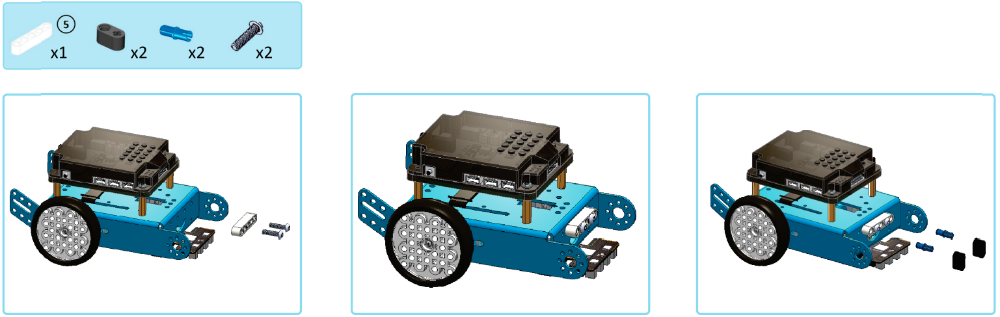
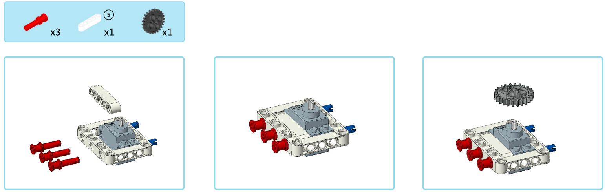

7. Xe gắp
=======================

Hướng dẫn lắp ráp
------------------
------------------

|   

Trước khi lắp ráp, bạn cần chỉnh động cơ Servo về đúng góc. 

Vào OhStem App > Chọn thiết bị xBot > Mở rộng > Xe gắp.

Thứ tự thực hiện như sau: 

.. image:: images/invento_14.png
    :width: 400px
    :align: center
|

|  

| 

Kết nối Servo vào chân S1 của bộ điều khiển 

.. image:: images/invento_15.png
    :width: 400px
    :align: center
|  

1. Kết nối App OhStem với xBot 
2. Bật công tắc (Sang chế độ "Bật")
3. Tắt công tắc (Sang chế độ "Thả")

|  

1. Tắt nguồn 
2. Tháo Servo
3. Tiếp tục lắp các bước kế tiếp 

| 

|   

|   

| 

|  

|   

|  

|   
