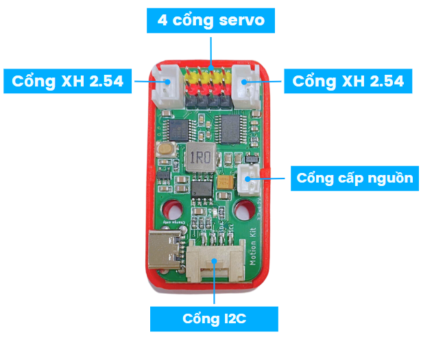
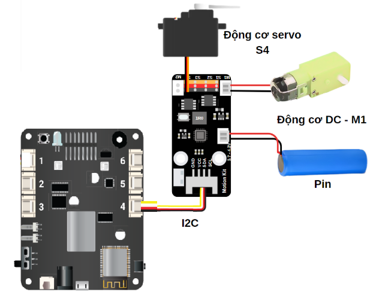
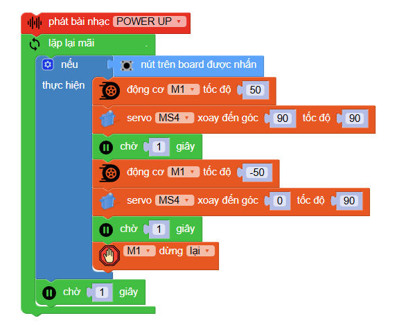
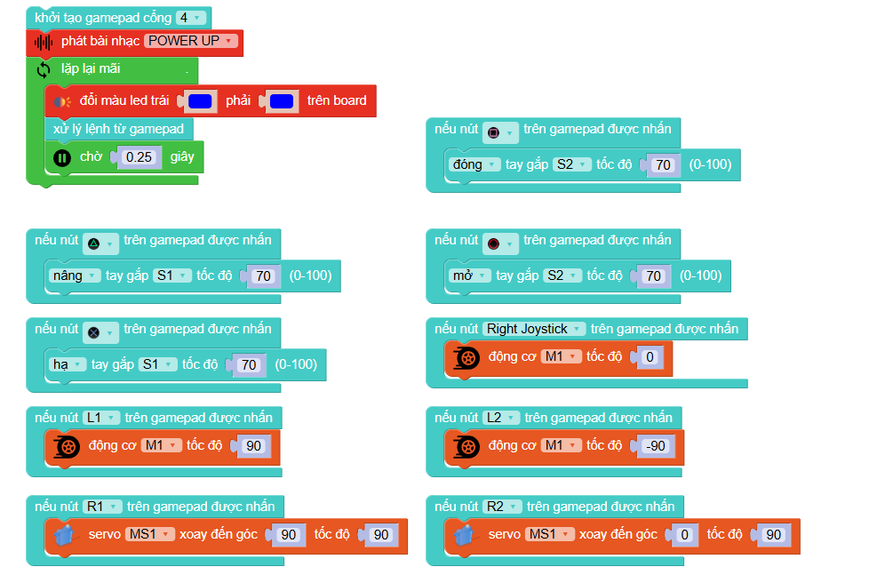

**Mạch mở rộng Motion Kit**
=========

**1. Giới thiệu**
---------
------------

.. image:: images/motion-kit.1.png
    :width: 400px
    :align: center
|

Mạch mở rộng Motion Kit là một công cụ giúp nâng cao khả năng của robot xBot, cho phép mở rộng cổng kết nối động cơ một cách dễ dàng. Nhờ có Motion Kit, robot xBot có thể tích hợp thêm các cơ cấu như cuộn bóng hay bắn bóng và nhiều cơ cấu sáng tạo khác từ bạn.

Với 4 cổng động cơ servo, 2 cổng động cơ XH 2.54, 1 cổng cấp nguồn và 1 cổng Grove, Motion Kit mang đến sự linh hoạt tối ưu trong việc kết nối và điều khiển nhiều loại động cơ khác nhau.

|

Trong hướng dẫn này, chúng tôi sẽ hướng dẫn bạn cách kết nối thêm 1 động cơ DC và 1 động cơ servo với robot xBot, giúp bạn mở rộng thêm cơ cấu robot của mình. 

**2. Thông số kỹ thuật**
---------
------------

- Hỗ trợ nguồn pin 3.7V
- Tích hợp mạch sạc
- Hỗ trợ động cơ DC dưới 6V

 
**3. Kết nối phần cứng**
---------
------------   

- **Bước 1**: Chuẩn bị các thiết bị như sau: 

.. list-table:: 
   :widths: auto
   :header-rows: 1
     
   * - .. image:: images/motion-kit.1.png
          :width: 150px
          :align: center
     - .. image:: images/xbot_1.png
          :width: 400px
          :align: center
     - .. image:: images/servo.png
          :width: 400px
          :align: center
     - .. image:: images/dong-co-dc.png
          :width: 200px
          :align: center
   * - Motion Kit (kèm dây tín hiệu)
     - Robot xBot
     - Động cơ servo
     - Động cơ DC giảm tốc 6V
   * - `Mua sản phẩm <https://shop.ohstem.vn/san-pham/mach-mo-rong-motion-kit/>`_
     - `Mua sản phẩm <https://shop.ohstem.vn/san-pham/robot-lap-trinh-xbot-stem-robot-kit/>`_
     - `Mua sản phẩm <https://shop.ohstem.vn/san-pham/dong-co-servo-mg90s/>`_
     - `Mua sản phẩm <https://shop.ohstem.vn/san-pham/dong-co-dc-giam-toc-6v/>`_

- **Bước 2**: Kết nối các thiết bị như hình
    
    + Kết nối Motion Kit vào cổng I2C trên xBot
    + Trên Motion Kit kết nối: 
        - Servo vào cổng S4
        - Động cơ DC vào cổng M1 
        - Pin vào cổng nguồn

|

**5. Hướng dẫn lập trình**
--------
------------

1. Tải thư viện **Motion Kit**, bằng cách dán đường link sau vào phần tìm kiếm thư viện: `<https://github.com/AITT-VN/xbot_extension_motionkit.git>`_

    Xem hướng dẫn tải thư viện `tại đây <https://docs.ohstem.vn/en/latest/module/thu-vien-yolobit.html>`_

    ..  figure:: images/motion-kit.4.png
        :scale: 80%
        :align: center 
    |

    Thư viện sẽ gồm các câu lệnh điều khiển 2 động cơ và 4 servo:

    ..  figure:: images/motion-kit.5.png
        :scale: 80%
        :align: center 
    |   

2. **Viết chương trình:**

**2.1. Chương trình kiểm tra hoạt động của Motion Kit và các động cơ mở rộng:**

    Với chương trình mẫu sau, bạn có thể dùng nút trên mạch xBot để điều khiển module mở rộng Motion Kit:

    Link chương trình: `<https://app.ohstem.vn/#!/share/xbot/2q3uTkIHbssuJbHUSl9rofX0iiI>`_      

.. note:: 
    Khi nhấn nút trên mạch được nhấn, động cơ M1 sẽ quay với tốc độ 50, đồng thời 4 cổng servo sẽ quay đến vị trí 90. Sau đó dừng lại 1 giây, động cơ M1sẽ quay ngược chiều với tốc độ 50 và servo 4 sẽ quay về vị trí 0. 

**2.2. Chương trình kết hợp robot xBot với Motion Kit cùng các động cơ để tạo nên phần cuộn bóng cho robot và được điều khiển từ Gamepad**

    Link chương trình: `<https://app.ohstem.vn/#!/share/xbot/2q3xDjUfwDg5kqPHPoKrUkk8Hxa>`_

.. note::
    Chúng ta sẽ dùng 4 nút L1-L2-R1-R2 để điều khiển thêm servo và động cơ cho cơ cấu tùy chỉnh lắp thêm ở xBot.