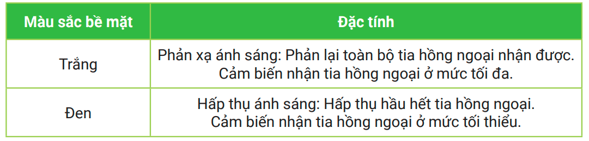

8. Bài 4: Robot dò đường 
================================

**Mục tiêu:**

Hiểu về cảm biến dò đường và cách lập trình cho robot di chuyển chính xác theo đường kẻ.

1. Giới thiệu về tia hồng ngoại
------------------------
------------------------

Để giúp robot có thể di chuyển chính xác, chúng ta có thể thiết lập sẵn một đường đi đặc biệt cho chúng.

**Ví dụ:** đoàn tàu di chuyển trên các đường ray. Sử dụng vạch đen và cảm biến hồng ngoại cũng là một công nghệ phổ biến thường áp dụng. Nhờ vào cảm biến hồng ngoại, robot sẽ nhận biết được các vạch đen và có thể di chuyển theo.

|  

- **Tia hồng ngoại là gì?**

Ánh sáng hồng ngoại là **ánh sáng có bước sóng lớn hơn 700nm** và mắt người không thể nhìn thấy được (*Mắt thường chỉ nhìn được ánh sáng có bước sóng trong khoảng 400nm đến 700nm)

| 

- **Ứng dụng của tia hồng ngoại**

Tia hồng ngoại có rất nhiều ứng dụng trong cuộc sống:

| 

| 

| 

2. Cảm biến dò đường
-------------------------
-------------------------

Cảm biến dò đường là một loại cảm biến hồng ngoại, hoạt động bằng cách **phát ra tia hồng ngoại xuống bề mặt và cảm nhận lượng tia hồng ngoại phản xạ trở lại.**

|  
Dựa vào đặc tính phản xạ ánh sáng trên bề mặt, cảm biến sẽ phát hiện ra được màu đen và trắng:

| 

| 
- **Hướng dẫn chỉnh mắt đọc hồng ngoại**

Cảm biến đi kèm sản phẩm đã được tinh chỉnh để pahan biệt được vạch đen và nên trắng. Nếu cảm biến hoạt động không chính xác, bạn có thể chỉnh lại theo cách sau:

|    

3. Đọc trạng thái cảm biến dò đường
-----------------------------
-----------------------------
Cảm biến dò đường mặc định được kết nối đến Cổng 1 trên mạch điều khiển.

| 

- **Khối lệnh sử dụng**

| 

- **Chương trình đọc trạng thái cảm biến**

Viết chương trình cho 2 LED RGB trên xBot theo 4 trường hợp mô tả dưới đây:

| 
Sơ đồ xử lý chương trình như sau:

| 
Để tạo ra 4 nhánh điều kiện, bạn áp dụng phương pháp đã học ở bài trước bằng cách thêm 3 khối lệnh *nếu không nếu* trong khối lệnh *nếu...thực hiện* nhé:

|  
Toàn bộ khối lệnh của chương trình như sau:

| 

4. Áp dụng cảm biến để di chuyển
---------------------------
---------------------------

- **Chương trình 1**

Sau khi nhấn nút, robot di chuyển về phía trước và dừng lại khi gặp vạch đen.

*Mô tả*

| 
*Chương trình*   

|   

- **Chương trình 2: Robot băng qua đường**

Ở bài này chúng ta sẽ sử dụng bản đồ (đi kèm) và lập trình cho robot băng qua đường. Robot sẽ băng qua đường tại vị trí có vạch kẻ trên bản đồ.

Robot cần băng qua 5 vạch (tính cả 2 vạch của đường). Sau khi chạm vạch cuối, xBot cần di chuyển thêm một chút nữa để qua hẳn đường trước khi dừng lại.

.. image:: Images/xbot_105.png
    :width: 500px
    :align: center
|   
*Gợi ý*

Hãy tạo một biến tên là **đếm**. Ban đầu biến đếm sẽ được gán giá trị là 0. Chúng ta sẽ thêm phần khối lệnh **chờ nút nhấn** để bắt đầu chương trình.

|   
Trong vòng lặp chính, ta sẽ yêu cầu robot tiến tới, **nếu robot gặp vạch đen, giá trị biến đếm sẽ tăng 1**. Đồng thời, chúng ta cần chờ cho robot di chuyển qua khỏi vạch đen để tránh đếm trùng nhiều lần.

|   
Sau đó chương trình sẽ kiểm tra xem giá trị đếm có tới số 5 chưa, nếu là số 5 thì sẽ cho robot dừng di chuyển.

|   
Tuy nhiên, sau đó vòng lặp sẽ quay lại và tiếp tục xử lý chương trình từ đầu. Chúng ta sẽ dùng thêm **khối lệnh thoát ra khỏi vòng lặp**, kết thức chương trình để giải quyết vấn đề này.

|   
Bạn hãy đặt xBot trên bản đồ có 5 vạch đen và chạy thử chương trình xem nào.

5. Robot dò đường
--------------------
--------------------

Dựa vào những gì chúng ta đã hiểu về cảm biến ở phần trước, chúng ta sẽ viết chương trình điều khiển xBot vừa đi vừa dò đường bằng 2 mắt: S1 và S4, sử dụng bản đồ đi kèm sản phẩm. Mô tả như sau:

.. image:: Images/xbot_110.png
    :width: 500px
    :align: center 
|

Sơ đồ xử lý của chương trình sẽ như sau:

|   
**Thực hiện chương trình**

1. Sử dụng các khối lệnh quen thuộc để cảm biến có thể phát hiện vạch đen:

.. image:: Images/xbot_112.png
    :width: 500px
    :align: center
|   
2. Tạo thêm 2 nhánh điều kiện

|   
3. Thêm các trường hợp còn lại theo hình để xe đi theo line

.. image:: Images/xbot_114.png
    :width: 500px
    :align: center
|   
Sau khi chạy chương trình trên, bạn sẽ thấy xBot đi theo đường thẳng khá tốt, tuy nhiên đến khu vực bãi đậu xe nơi có các vạch đen ngang thì xBot sẽ không vượt qua được. Bạn cần điều chỉnh chương trình một chút để robot vẫn đi thẳng tiếp khi gặp các vạch đen ngang này.

Chương trình sau khi chỉnh sửa sẽ như sau:

.. image:: Images/xbot_115.png
    :width: 500px
    :align: center
|   
Bạn có thể thử thay đổi tốc độ trong các trường hợp để robot di chuyển ổn định hơn và ít bị chệch khỏi đường line nhé.

6. Bài tập mở rộng
-----------------------
-----------------------

**Robot đậu xe thông minh**

Trong bài này, bạn hãy viết chương trình để robot có thể đạu xe vào đúng vị trí số 3 bằng cách **nhận diện các vạch đen nằm ngang**. 

Bãi xe bao gồm 3 chỗ. Chúng ta sẽ sử dụng mô hình bãi xe trên bản đồ đi kèm.

.. image:: Images/xbot_116.png
    :width: 500px
    :align: center
|   
**Gợi ý cách làm**

1. Dùng biến đếm để đếm số lần nhận vạch ngang

2. Robot sẽ đến vị trí số 3 khi đếm = 3

3. Robot cần xoay sang phải và lùi lại để vào đúng vị trí

7. Câu hỏi ôn tập
------------------
------------------

1. Làm thế nào mà robot có thể tự động đi theo vạch kẻ sẵn?

2. Viết ra nguyên lý hoạt động của cảm biến dò đường.

3. Chỉ ra các khối lệnh để làm việc với cảm biến dò đường trên OhStem App.

