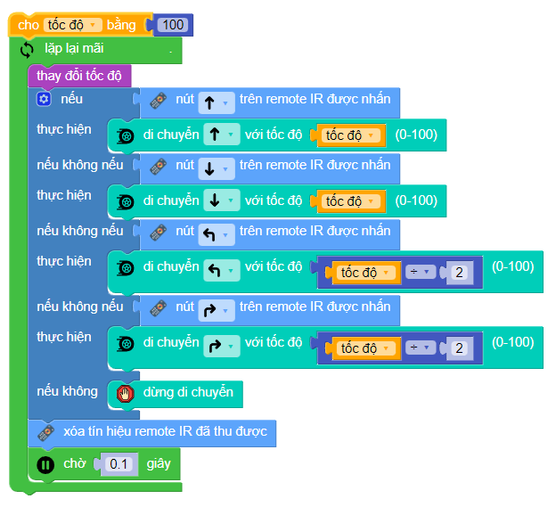
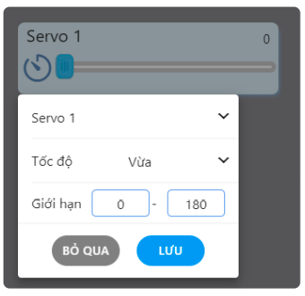
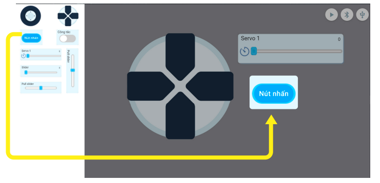

11. Bài 7: Điều khiển từ xa
===========================

**Mục tiêu:**

Biết cách sử dụng remote hồng ngoại và phần mềm OhStem App để điều khiển robot từ xa theo ý muốn.

1. Điều khiển bằng remote hồng ngoại
-----------------------------------
-----------------------------------

**Mắt nhận hồng ngoại và remote**

Trên mạch điều khiển xBot có tích hợp sẵn một mắt nhận tín hiệu hồng ngoại, giúp xBot có thể đọc được tín hiệu từ remote đi kèm xBot.

|   
Remote hồng ngoại đi kèm xBot:

|   

**Yêu cầu đặt ra**

Trên remote có nhiều nút nhấn, chúng ta sẽ viết chương trình cho xBot nhận được tín hiệu khi ta nhấn các phím mũi tên và nút số, trong đó:

- Các phím mũi tên: Điều khiển hướng di chuyển

- Các phím số: Điều chỉnh tốc độ

|   
**Đọc nút nhấn từ remote**

Để xBot đọc được tín hiệu, bạn cần sử dụng các khối lệnh sau:

.. image:: Images/xbot_142.png
    :width: 800px
    :align: center
|   
Để dễ hiểu, chúng ta sẽ viết chương trình đơn giản:

- Nút A được nhấn: bật đèn đỏ

- Nút B được nhấn: bật đèn xanh

Sơ đồ xử lý như sau:

|   
Chương trình khối lệnh như sau:

.. image:: Images/xbot_144.png
    :width: 600px
    :align: center
|   
Sau khi chạy chương trình, bạn thử nhấn nút A và B trên remote để xem kết quả.

**Điều khiển di chuyển**

Trong chương trình này, chúng ta sẽ liên tục kiểm tra và cho xBot di chuyển theo đúng hướng dựa vào nút được nhấn.

Sơ đồ xử lý của chương trình:

.. image:: Images/xbot_145.png
    :width: 400px
    :align: center
|   
Chương trình khối lệnh như sau:

|   
**Thay đổi tốc độ**

Chúng ta sẽ viết chương trình thay đổi tốc độ cho xBot. Bằng cách sử dụng 4 nút số và thay đổi tốc độ tương ứng như sau:

Để thay đổi được tốc độ, chúng ta sử dụng biến để lưu tốc độ hiện tại và thay đổi nó khi nhận được lệnh từ các nút số.

|   
Ban đầu ta cho biến này là giá trị 100, nghĩa là tốc độ tối đa.

Để chương trình ngắn gọn, hãy tạo một hàm riêng để xử lý các nút nhấn và thay đổi tốc độ.

Sơ đồ xử lý của hàm đó như sau:

|   
Chương trình của hàm:

|   
Sau đó sử dụng hàm và biến tốc độ vào chương trình cũ, chúng ta có chương trình sau:

|   
Khi nhấn nút để rẽ trái hoặc phải, ta sẽ cho robot di chuyển với tốc độ bằng nửa tốc độ được cài đặt bằng cách dùng **khối lệnh tốc độ ÷ 2**.

Sau khi chạy chương trình, bạn thử nhấn các nút 1 đến 4 trên remote và di chuyển để xem tốc độ thay đổi giữa các lần nhấn nút có đúng không nhé.

2. Điều khiển bằng điện thoại qua Bluetooth
-------------------------------------------
-------------------------------------------

Có một cách khác để điều khiển xBot từ xa, đó là sử dụng phần mềm OhStem App. Chúng ta có thể dùng các giao diện điều khiển trong mục **Chơi** của phần mềm.

.. image:: Images/xbot_151.png
    :width: 700px
    :align: center
|   
Tuy nhiên, bạn cũng có thể tự tạo một giao diện điều khiển theo yêu cầu riêng của bạn cho các mục đích sau:

.. image:: Images/xbot_152.png
    :width: 700px
    :align: center
|   
**Tạo bảng điều khiển**

1. Để tạo một bảng điều khiển mới, bạn hãy vào mục **Sáng tạo**:

.. image:: Images/xbot_153.png
    :width: 700px
    :align: center
|   
2. Sau đó nhấn vào biểu tượng Tạo mới, phần mềm sẽ mửo ra giao diện thiết kế bảng điều khiển mới:

.. image:: Images/xbot_154.png
    :width: 600px
    :align: center
|   
3. Bạn có thể kéo các loại điều khiển (còn gọi là widget) bên trái vào trong và sắp xếp theo ý bạn.

**Các loại điều khiển**

Phần mềm hỗ trợ các loại widget như bảng sau:

.. image:: Images/xbot_155.png
    :width: 700px
    :align: center
|   
.. image:: Images/xbot_156.png
    :width: 700px
    :align: center
|   
**Bảng điều khiển động cơ Servo, đèn và âm nhạc

Chúng ta hãy tạo thử một bảng điều khiển có những chức năng sau:

1. Có thể di chuyển bằng nút điều khiển 4 hướng

2. Có thanh kéo Servo để điều khiển góc quay của Servo nối vào cổng S1

3. Có nút nhấn để bật còi cảnh báo

4. Có nút bật tắt để bật tắt đèn LED

*Nếu bạn không có sẵn động cơ Servo thì có thể bỏ qua mục số 2.*

**Hướng dẫn thực hiện**

1. Kéo widget D-pad và thanh Servo S1 vào, thực hiện như sau:

.. image:: Images/xbot_157.png
    :width: 700px
    :align: center
|   
2. Cấu hình cho thanh kéo:

Bạn nhấn vào widget thanh kéo Servo, chọn Cài đặt và cấu hình như hình minh họa.

Bạn có thể thay đổi tốc độ quay của Servo tùy ý. Bạn chọn cổng Servo đúng với cổng dùng để cắm Servo, từ 1 đến 8.

|   
3. Đưa nút nhấn vào để bật còi cảnh báo:

|   
4. Bạn nhấn vào Nút nhấn và chọn đổi tên thành "Còi xe"

|   
5. Cấu hình cho nút: chọn *Code khi nhấn nút* để viết chương trình như hình minh họa:

.. image:: Images/xbot_161.png
    :width: 700px
    :align: center
|   
Sau khi xây dựng chương trình xong, bạn nhấn vào nút X ở góc trái màn hình để đóng.

Lưu ý: Trong lúc viết chương trình, bạn có thể nhấn vào các nút Chạy và Dừng để kiểm tra chương trình. Bạn cũng có thể mở một chương trình đã lưu để sử dụng. 

6. Thêm vào một nút bật tắt và đặt tên là "Đèn xe"

.. image:: Images/xbot_162.png
    :width: 600px
    :align: center
|   
7. Viết chương trình cho 2 trường hợp là khi nút được bật và tắt.

.. image:: Images/xbot_163.png
    :width: 500px
    :align: center
|   
Sau khi hoàn thành bảng điều khiển mới, bạn nhấn vào biểu tượng Play ở góc phải để chuyển sang chế độ điều khiển như hình minh họa phía dưới:

|   
Cuối cùng, hãy tiến hành kết nối xBot và sử dụng bảng điều khiển vừa tạo xem có hoạt động đúng như mình cài đặt không nhé.

