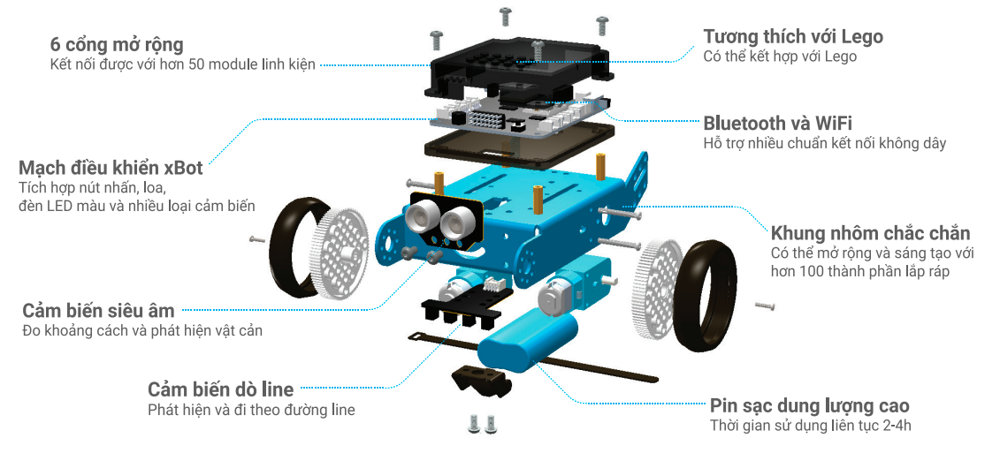
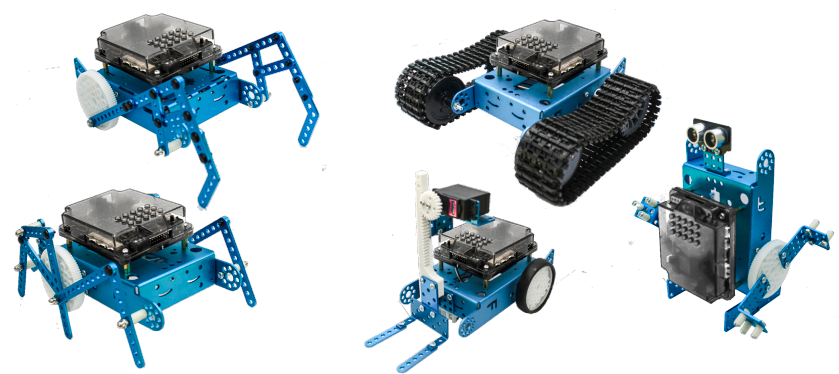
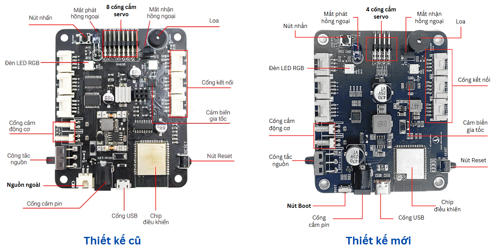
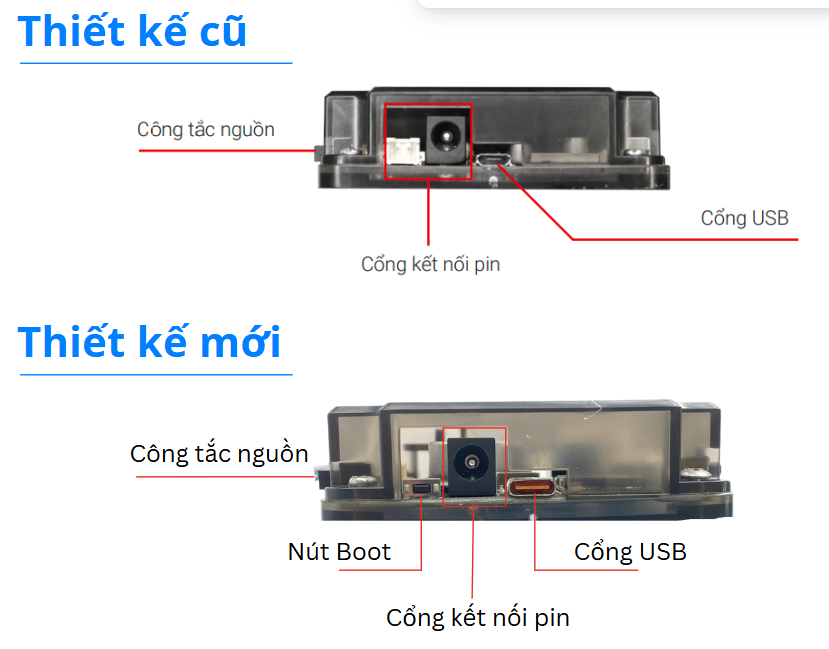

1. Làm quen với xBot
==============================

**Mục tiêu:**

Giúp người mới làm quen với robot xBot, hiểu được các thành phần bên trong, cách lắp ráp hoàn chỉnh và các cách điều khiển theo ý muốn

1. xBot là gì?
--------------------
-------------------

xBot là một robot giáo dục, giúp các bạn nhỏ từ 8 tuổi có thể lắp ráp và lập trình dễ dàng. Ngaoì việc phục vụ cho nhu cầu học tập, xBot cũng là một món đồ chơi giải trí hấp dẫn và thông minh. 

|   
xBot được điều khiển và lập trình bằng các thiết bị như smartphone, máy tính bảng, laptop hoặc remote đi kèm thông qua các khối lệnh đơn giản và trực quan.

|   
xBot là công cụ giúp bạn làm quen với thế giới thiết kế và lập trình  robot dễ dàng.

|   

**So sánh xBot với các robot có chức năng tương đương của Lego**

.. image:: Images/xbot_4.png
    :width: 900px
    :align: center  
|

**BẢNG CÁC LINH KIỆN MỞ RỘNG CỦA XBOT**

.. image:: Images/xbot_6.png
    :width: 900px
    :align: center  

.. image:: Images/xbot_7.png
    :width: 900px
    :align: center 

|

**Robot xBot làm được gì?**

Khi sở hữu một robot xBot trong tay, bạn có thể làm được nhiều thứ với nó. Chúng ts thử tìm hiểu xem xBot có thể làm được những gì nhé.

- **Giải trí**

xBot có thể điều khiển từ xa thông qua remote đi kèm theo phần mềm OhStem App.

.. image:: Images/xbot_9.png
    :width: 600px
    :align: center
| 

- **Rèn luyện tư duy logic và kỹ năng giải quyết vấn đề**

|

- **Sáng tạo**

Tự thiết kế là lắp ráp các mô hình theo ý thích, giúp kích thích và rèn luyện tư duy sáng tạo của các em.

|   

2. Thành phần của xBot
------------------------
------------------------

- **Mạch điều khiển xController**

Mạch điều khiển xController đóng vai trò là bộ xử lý trung tâm của xBot, giúp kết nối các thành phần quan trọng như input, output, nguồn pin,...

|

- **Mô tả**

|
- **Các cảm biến đi kèm**

.. image:: Images/xbot_19.png
    :width: 600px
    :align: center
|   
- **Các cổng mở rộng**

.. image:: Images/xbot_20.png
    :width: 400px
    :align: center
|   
- **Kết nối với mạch điều khiển xBot**

Bạn có thể điều khiển và lập trình xBot bằng máy tính, điện thoại, máy tính bảng,... thông qua công nghệ Bluetooth, WiFi hoặc cáp USB

|  

3. Cấp nguồn và khởi động xBot
------------------------
------------------------

|  

- **Cổng USB**

Cổng USB giúp kết nối máy tính với mạch điều khiển, đồng thời cấp nguồn cho xBot khi không dùng đến động cơ.

- **Cổng kết nối pin**

Mạch điều khiển xBot sử dụng đầu cắm pin đi kèm bộ kit là jack DC 5.5x2.1mm. 

**Để điều khiển động cơ, bạn cần sử dụng nguồn điện cấp từ pin** thay vì USB (động cơ cần nguồn điện mạnh hơn điện từ cổng USB).

- **Công tắc nguồn**

Để bật nguồn cho xBot, bạn cần gạt công tắc nguồn sang ON. Trạng thái của mạch:

    1. Đèn báo nguồn màu đỏ trên mạch sẽ sáng, robot bắt đầu khởi động

    2. Sau khi khởi động thành công, 2 đèn LED đa màu trên mạch sẽ phát sáng màu đỏ, thể hiện chế độ đang chờ kết nối

.. image:: Images/xbot_20.3.png
    :width: 500px
    :align: center
|  

4. Các chế độ hoạt động của xBot
------------------------
------------------------

xBot có 3 chế độ hoạt động cơ bản:
    - Nhấn nút để robot chạy các chế độ thông minh
    - Điều khiển bằng remote đi kèm
    - Điều khiển bằng OhStem App
Ở phần này chúng ta sẽ cùng tìm hiểu về chế độ điều khiển bằng remote và nút nhấn. 

Chế độ **điều khiển bằng OhStem App** sẽ được tìm hiểu ở bài sau. 

- **Điều khiển bằng nút nhấn**

xBot đã tích hợp sẵn một nút nhấn trên mạch điều khiển, giúp người dùng có thể bật các chế độ thông minh một cách nhanh chóng. 

.. image:: Images/xbot_20.4.png
    :width: 400px
    :align: center
|  
Bạn có thể nhấn nút trên mạch điều khiển nhiều lần để chuyển sang chế độ hoạt động mà mình thích, thứ tự chuyển đổi các chế độ sẽ như sau:

.. image:: Images/xbot_20.5.png
    :width: 600px
    :align: center
| 
- **Điều khiển bằng remote**

| 
