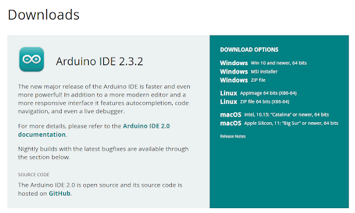
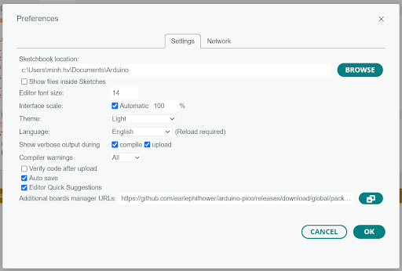
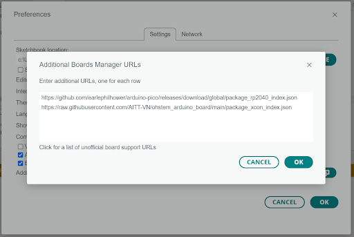
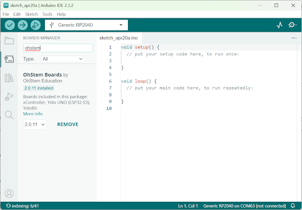
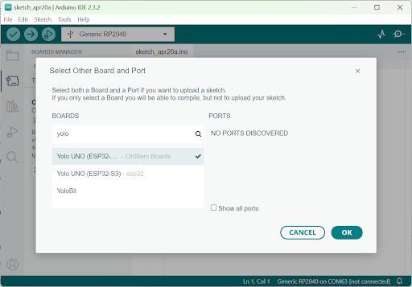

1. Hướng Dẫn Cài Đặt Arduino và Yolo UNO 
===========

- **Bước 1**: Vào trang chủ của Arduino để download **Arduino IDE** theo link này `<https://www.arduino.cc/en/software/>`_. Trong mục Download options như hình dưới, bạn chọn **Win 10 and newer** để download.

    Giao diện download Arduino IDE

- **Bước 2**: Cài đặt hỗ trợ các board OhStem để Arduino hỗ trợ Yolo UNO

    Mở phần mềm Arduino IDE đã tải về, vào **File > Preferences**. Trong tab **Settings**, chọn các tùy chọn như hình dưới:

|

**Sketchbook location** là đường dẫn mà bạn muốn lưu các file chương trình. Trong Windows đường dẫn mặc định là  **C:\Users\YourUserName\Documents\Arduino** còn trên các hệ điều hành Linux hoặc MacOS thì đường dẫn mặc định là **/home/name_your_computer/Arduino**. Đây cũng sẽ là nơi lưu những thư viện cho Arduino mà chúng ta sẽ thêm vào sau này.

Trong mục **Additional Board Manager URLs**, nhấn vào nút mở cửa sổ bên cạnh để mở ra cửa sổ mới và nhập vào đường dẫn đến thư viện dành riêng cho các mạch của OhStem là: 

`<https://raw.githubusercontent.com/AITT-VN/ohstem_arduino_board/main/package_xcon_index.json>`_

Thư viện cho mỗi loại mạch sẽ được đặt trên 1 hàng riêng biệt như hình dưới đây:

|

Để hỗ trợ nhiều loại board khác nhau, bạn có thể nhập thành nhiều dòng bằng cách Enter xuống dòng cho từng URL.

- **Bước 3**: Mở menu **Tools > Board > Boards Manager…** hoặc nhấn vào biểu tượng bo mạch trên menu dọc trái, gõ ohstem vào thanh tìm kiếm, chọn **board OhStem Boards by OhStem Education** như hình dưới và nhấn vào **Install**.

|

Sau khi cài đặt, kết nối mạch Yolo UNO với máy tính qua dây cáp USB, chọn mạch Yolo UNO và kết nối.

|

Nếu Yolo UNO đang được nối với máy tính thì phần Tools \ Port sẽ xuất hiện 1 COM port (không phải COM1, COM2), ví dụ COM3, COM4 hay COM5… tức là PC đã nhận được board và việc cài đặt phần mềm đã thành công.

