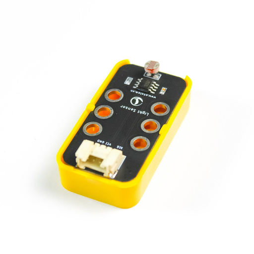
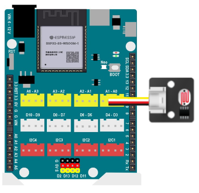
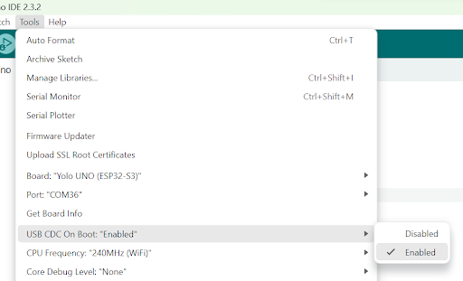
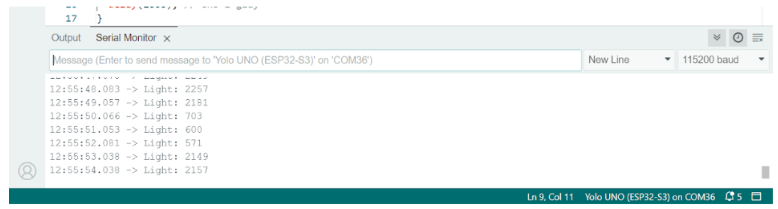

4. Cảm biến ánh sáng
=========

1. Giới thiệu 
---------
--------

Cảm biến ánh sáng loại analog là loại cảm biến có thể đo cường độ ánh sáng môi trường xung quanh và chuyển đổi thành tín hiệu điện áp analog. Tín hiệu điện áp này tỷ lệ thuận với cường độ ánh sáng, nghĩa là ánh sáng càng mạnh, điện áp càng cao.

Cảm biến ánh sáng analog có nhiều loại khác nhau, sử dụng các nguyên lý hoạt động khác nhau, phổ biến nhất là:

- Cảm biến quang trở (LDR): Thay đổi điện trở khi tiếp xúc với ánh sáng.
- Photodiode: Tạo ra dòng điện khi tiếp xúc với ánh sáng.
- Phototransistor: Khuếch đại dòng điện do photodiode tạo ra.

Module cảm biến ánh sáng đi kèm trong bộ Yolo UNO Starter Kit là loại cảm biến quang trở.

|

2. Kết nối
------
--------

Kết nối cảm biến ánh sáng vào cổng A0 của Yolo UNO.

|

3. Chương trình Arduino
----------
-----

.. code-block:: arduino

    void setup() {

        Serial.begin(115200); // Khởi tạo Serial
            
        // Cau hinh chan analog
        pinMode(A0, INPUT);
    }

    void loop() {

        // Doc gia tri cam bien
        int sensorValue = analogRead(A0);
            
        // In ra gia tri anh sang
        Serial.print("Light: ");
        Serial.println(sensorValue); // In voi 2 chu so thap phan
            
        delay(1000); // Cho 1 giay
    }

Trước khi upload chương trình, bạn cần kiểm tra và đảm bảo lựa chọn USB CDC On Boot được bật như dưới đây để có thể xem được các giá trị in ra cửa sổ Serial:

|

Sau khi upload, bạn quan sát giá trị cường độ ánh sáng được in ra cửa sổ Serial và sự thay đổi khi bạn che cảm biến lại.

|