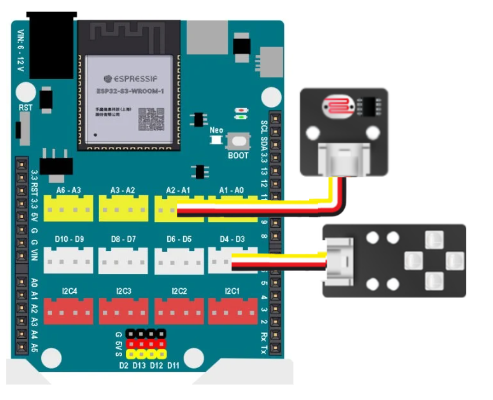

8. Đèn thông minh dùng LED RGB
========

1. Mục tiêu
---------
---------

Sử dụng cảm  biến ánh sáng (cổng A1) và LED màu (cổng D3) để điều khiển đèn LED. Khi mức độ ánh sáng thấp, đèn sẽ sáng, ngược lại khi mức độ sáng cao, đèn sẽ tắt.

2. Kết nối 
-----
---------

- Kết nối module LED RGB vào chân D3-D4
- Kết nối cảm biến ánh sáng vào chân A1-A2

|

3. Chương trình Arduino
------
-------

.. code-block:: arduino

    #include <Arduino.h>
    #include <Adafruit_NeoPixel.h>

    Adafruit_NeoPixel rgb(4, D3, NEO_GRB + NEO_KHZ800);

    void setup() {
        rgb.begin();
    }

    void loop() {
        // cảm biến ánh sáng gắn vào cổng A1
        if ((analogRead(A1)/10.24 < 30)) {
            rgb.fill(rgb.Color(255,255,255));
            rgb.show();
        } else {
            rgb.fill(rgb.Color(0,0,0));
            rgb.show();
        }
    }