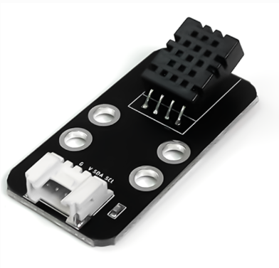
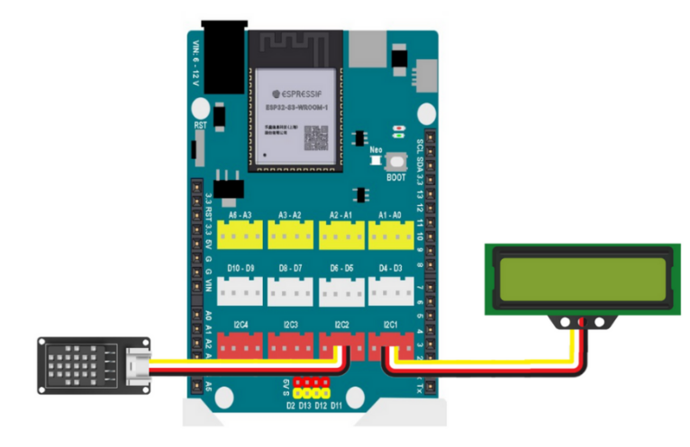
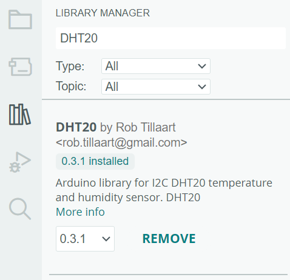

10. Giám sát và hiển thị nhiệt độ
=============

1. Mục tiêu
---------
---------

Cảm biến DHT20 là một cảm biến kỹ thuật số đo lường nhiệt độ và độ ẩm môi trường. Nó được sử dụng rộng rãi trong các ứng dụng như hệ thống điều hòa không khí, trạm thời tiết, thiết bị nhà thông minh, v.v. 

|

Cảm biến này có độ chính xác tốt hơn nhiều các loại DHT11 thường thấy và sử dụng kết nối I2C.

Chúng ta sẽ sử dụng DHT20 để đo và hiển thị lên trên màn hình LCD1602.

2. Kết nối 
-----
---------

Kết nối cảm biến nhiệt độ DHT20 và màn hình LCD1602 vào cổng I2C

|

3. Chương trình Arduino
------
-------

Bạn cần cài đặt thêm thư viện **DHT20** cho Arduino. 

|

.. code-block:: arduino

    #include "LiquidCrystal_I2C.h";
    #include "DHT20.h"

    #include <Arduino.h>

    LiquidCrystal_I2C lcd(0x21, 16, 2);
    DHT20 DHT;

    void setup() {
        //Initialize the LCD
        lcd.init();
        // Turn on the blacklight
        lcd.backlight();
    }

    void loop() {
        DHT.read();
        lcd.clear();
        lcd.setCursor(0, 0);
        lcd.print((DHT.getTemperature()));
        lcd.setCursor(0, 1);
        lcd.print((DHT.getHumidity()));
        delay(5000);
    }