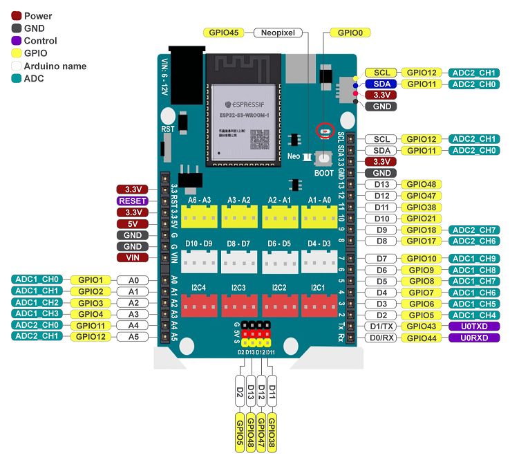

14. Yolo UNO với IoT
=============

1. Mục tiêu
---------
---------

Với hướng dẫn này, chúng ta sẽ thực hiện dự án điều khiển đèn led đơn tại chân D13 từ  bảng điều khiển IoT và  có thể mở rộng thực hiện điều khiển đèn, quạt từ xa thông qua bảng điều khiển IoT.

|

2. Kết nối 
-----
---------

Đèn led đơn được nối với chân D13 trên mạch Yolo UNO và được tích hợp sẵn trên mạch.

|

3. Chương trình Arduino
------
-------

Bạn cần cài đặt thêm thư viện **PubSubClient** cho Arduino. 

|

Nếu bạn muốn thêm bằng file zip thì có thể tại tại link sau: 
`<https://github.com/knolleary/pubsubclient.git>`_

---------
---------
**Chương trình tham khảo:**

.. code-block:: arduino

    #include <WiFi.h>
    #include <PubSubClient.h>
    #define ssid "abcd"  //Thay bằng wifi nhà bạn
    #define password "12345678"
    // Thông tin về MQTT Broker
    #define mqtt_server "mqtt.ohstem.vn" // Thay bằng thông tin của bạn
    #define mqtt_user "myUsername1"    //Thay bằng user va pass của bạn
    #define mqtt_pwd "1"
    const uint16_t mqtt_port = 1883; //Port của CloudMQTT

    WiFiClient espClient;
    PubSubClient client(espClient);

    void setup() {
    pinMode(D13, OUTPUT);
    Serial.begin(115200);
    // hàm thực hiện chức năng kết nối Wifi và in ra địa chỉ IP của Yolo UNO
    setup_wifi();
    // cài đặt server là mqtt.ohstem.vn và lắng nghe client ở port 1883
    client.setServer(mqtt_server, mqtt_port);
    // gọi hàm callback để thực hiện các chức năng publish/subcribe
    client.setCallback(callback);
    // gọi hàm reconnect() để thực hiện kết nối lại với server khi bị mất kết nối
    reconnect();
    }

    void setup_wifi() {
    delay(10);
    Serial.println();
    Serial.print("Connecting to ");
    Serial.println(ssid);
    // kết nối đến mạng Wifi
    WiFi.begin(ssid, password);
    // in ra dấu . nếu chưa kết nối được đến mạng Wifi
    while (WiFi.status() != WL_CONNECTED) {
        delay(500);
        Serial.print(".");
    }
    // in ra thông báo đã kết nối và địa chỉ IP của Yolo UNO
    Serial.println("");
    Serial.println("WiFi connected");
    Serial.println("IP address: ");
    Serial.println(WiFi.localIP());
    }
    void callback(char* topic, byte* payload, unsigned int length) {
    //in ra tên của topic và nội dung nhận được từ kênh MQTT đã publish
    Serial.print("Message arrived [");
    Serial.print(topic);
    Serial.print("] ");
    for (int i = 0; i < length; i++) {
        Serial.print((char)payload[i]);
    }
    // kiểm tra nếu dữ liệu nhận được từ topic username/feeds/kenh là chuỗi "1"
    // sẽ bật led D13 , nếu là chuỗi "1" sẽ tắt led chân D13. nếu dùng AI thì so sánh với classname để nhận tin
    if ((char)payload[0] == '0') //off
        digitalWrite(D13, LOW);
    else if ((char)payload[0] == '1') //on
        digitalWrite(D13, HIGH);
    Serial.println();
    }
    void reconnect() {
    // lặp cho đến khi được kết nối trở lại
    while (!client.connected()) {
        Serial.print("Attempting MQTT connection...");
        if (client.connect("Yolo UNO", mqtt_user, mqtt_pwd)) {
        Serial.println("connected");
        // publish gói tin "Connected!" đến topic username/feeds/kenh
        client.publish("myUsername1/feeds/V1", "Connected!");
        // đăng kí nhận gói tin tại topic username/feeds/kenh
        client.subscribe("myUsername1/feeds/V2");
        } else {
        // in ra màn hình trạng thái của client khi không kết nối được với MQTT broker
        Serial.print("failed, rc=");
        Serial.print(client.state());
        Serial.println(" try again in 5 seconds");
        // delay 5s trước khi thử lại
        delay(5000);
        }
    }
    }
    void loop() {
    // kiểm tra nếu Yolo UNO chưa kết nối được thì sẽ thực hiện kết nối lại
    if (!client.connected()) {
        reconnect();
    }
    client.loop();
    }