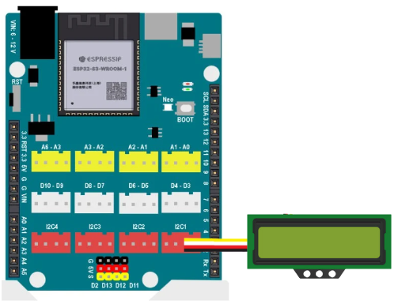
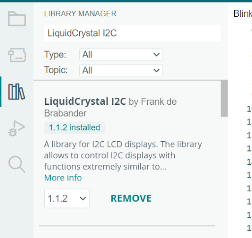

9. Hiển thị lên màn hình LCD1602
==========

1. Mục tiêu
---------
---------

Màn hình LCD 1602 là một loại màn hình hiển thị ký tự dạng điểm ảnh, được sử dụng phổ biến trong các dự án điện tử và tự động hóa. Màn hình có kích thước 16 ký tự x 2 dòng, có thể hiển thị chữ, số và các ký tự đặc biệt. Màn hình LCD 1602 hoạt động theo nguyên tắc phản xạ ánh sáng, do đó không cần đèn nền và tiêu thụ ít điện năng.

2. Kết nối 
-----
---------

Kết nối module quạt mini vào cổng D5 của Yolo UNO

|

3. Chương trình Arduino
------
-------

Bạn cần cài đặt thêm thư viện **LiquidCrystal_I2C by Frank de Brabander** cho Arduino. 

|

.. code-block:: arduino

    #include "LiquidCrystal_I2C.h";
    #include <Arduino.h>

    LiquidCrystal_I2C lcd(0x21,16,2); // địa chỉ màn hình là 0x21 hexa

    void setup() {
        //Initialize the LCD
        lcd.init();
        // Turn on the blacklight
        lcd.backlight();
    }

    void loop() {
        lcd.clear();
        lcd.setCursor(0, 0);
        lcd.print("OhStem");
        lcd.setCursor(0, 1);
        lcd.print(123);
        delay(5000);
    }
