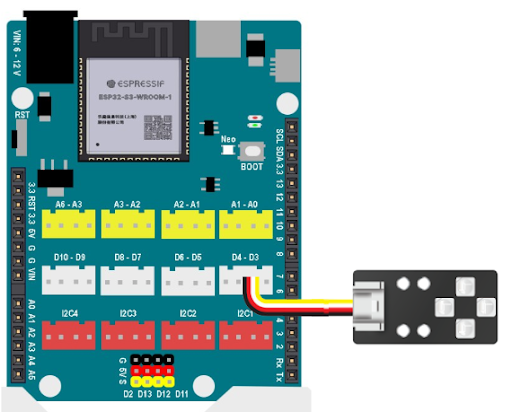

7. Đổi màu đèn LED RGB
==========

1. Mục tiêu
---------
---------

Viết chương trình điều khiển module LED RGB thay đổi thành các màu khác nhau.

|

2. Kết nối 
-----
---------

Nối module đèn LED RGB vào cổng D3-D4 của Yolo UNO.

|

3. Chương trình Arduino
------
-------

Bạn cũng cần cài đặt thêm thư viện **Adafruit_NeoPixel** trong Arduino.

.. code-block:: arduino

    #include <Adafruit_NeoPixel.h>

    // khởi tạo LED màu chân D3
    Adafruit_NeoPixel rgb(4, D3, NEO_GRB + NEO_KHZ800);

    void setup() {
        rgb.begin();
    }

    void loop() {
        rgb.setPixelColor(0, rgb.Color(255,102,0));
        rgb.setPixelColor(1, rgb.Color(255,102,0));
        rgb.setPixelColor(2, rgb.Color(255,102,0));
        rgb.setPixelColor(3, rgb.Color(255,102,0));
        rgb.show();
        delay(1000);
        rgb.setPixelColor(0, rgb.Color(0,0,0));
        rgb.setPixelColor(1, rgb.Color(0,0,0));
        rgb.setPixelColor(2, rgb.Color(0,0,0));
        rgb.setPixelColor(3, rgb.Color(0,0,0));
        rgb.show();
        delay(1000);
    }