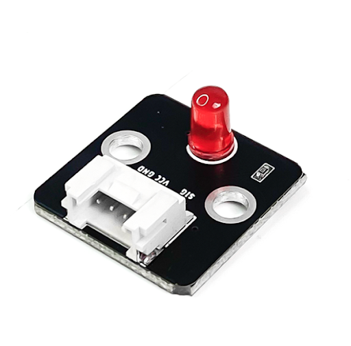
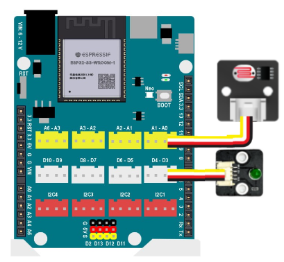

5. Đèn LED tự động
==============

1. Mục tiêu 
---------
--------

Trong hướng dẫn này, bạn sẽ lập trình cho Yolo UNO để bật tắt đèn LED theo kết quả đo được từ cảm biến ánh sáng, bật khi trời tối và tắt khi trời sáng.

|

2. Kết nối 
-----
---------

Kết nối cảm biến ánh sáng vào cổng A0 và module đèn LED đơn sắc vào cổng D3-D4 của Yolo UNO.

|

3. Chương trình Arduino
------
-------

.. code-block:: arduino

    void setup() 
    {
        Serial.begin(115200); // Khởi tạo Serial
        
        // Cấu hình chân GPIO
        pinMode(D3, OUTPUT); // Chân GPIO điều khiển đèn LED
        pinMode(A0, INPUT); // Chân analog đọc cảm biến ánh sáng
    }

    void loop() 
    {
        // Đọc giá trị cảm biến
        int sensorValue = analogRead(A0);
        
        // Điều khiển đèn LED
        if (sensorValue < 1000) { // Bật đèn LED khi ánh sáng thấp
            digitalWrite(D3, HIGH);
        } else {
            digitalWrite(D3, LOW); // Tắt đèn LED khi ánh sáng cao
    }
    
        // In ra giá trị ánh sáng
        Serial.print("Light: ");
        Serial.println(sensorValue);
        
        delay(1000); // Chờ 1 giây
    

Sau khi upload chương trình, bạn quan sát giá trị cường độ ánh sáng được in ra cửa sổ Serial và trạng thái của đèn LED khi bạn che cảm biến lại.