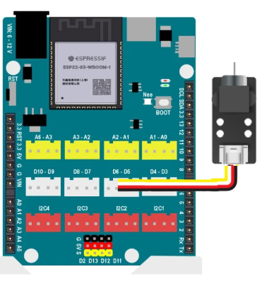

6. Lập trình PWM với module quạt mini
=========

1. Mục tiêu
---------
---------

Trong bài này, chúng ta sẽ lập trình thay đổi tốc độ quay của module quạt mini sử dụng kỹ thuật PWM đã nhắc đến trong chương 3 ở phần bộ truyền động.

|

2. Kết nối 
-----
---------

Kết nối module quạt mini vào cổng D5 của Yolo UNO

|

3. Chương trình Arduino
------
-------

Để sử dụng PWM trong Arduino, ta dùng hàm **analogWrite()**. Bạn không cần gọi hàm **pinMode()** để đặt chế độ OUTPUT cho chân sẽ dùng để phát xung PWM trên mạch Arduino.

Cú pháp: **analogWrite([chân phát xung PWM], [giá trị xung PWM])**;

Giá trị mức xung PWM nằm trong khoảng từ 0 đến 255, tương ứng với mức duty cycle từ 0% đến 100%.

.. code-block:: arduino

    void setup() {
        // Cấu hình chân PWM
        pinMode(D5, OUTPUT);
    }

    void loop() {
        // Thay đổi chu kỳ duty cycle PWM
        for (int dutyCycle = 0; dutyCycle <= 255; dutyCycle++) {
            analogWrite(D5, dutyCycle); // Điều chỉnh tốc độ quay của quạt
            delay(10); // Chờ 10 mili giây
    }

        // Thay đổi chu kỳ duty cycle PWM theo hướng ngược lại
        for (int dutyCycle = 255; dutyCycle >= 0; dutyCycle--) {
            analogWrite(D5, dutyCycle); // Điều chỉnh tốc độ quay của quạt
            delay(10); // Chờ 10 mili giây
        }
    }

Sau khi upload, bạn sẽ thấy tốc độ quay của module quạt mini sẽ thay đổi từ 0 đến tối đa và ngược lại liên tục.