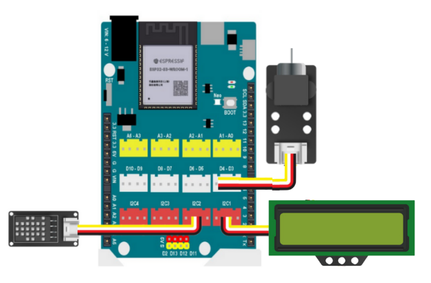

11. Quạt tự động
=========

1. Mục tiêu
---------
---------

Trong chương trình này, chúng ta sử dụng cảm biến DHT20 để đo nhiệt độ, khi nhiệt độ lớn hơn 28 sẽ bật quạt chân D3, ngược lại, nhiệt độ bé hơn 28 sẽ tắt quạt.

2. Kết nối 
-----
---------

- Kết nối cảm biến nhiệt độ DHT20 và màn hình LCD1602 vào cổng I2C
- Module quạt mini vào cổng D3-D4

|

3. Chương trình Arduino
------
-------

.. code-block:: arduino

    #include "LiquidCrystal_I2C.h";
    #include "DHT20.h"

    #include <Arduino.h>

    LiquidCrystal_I2C lcd(0x21, 16, 2);
    DHT20 DHT;

    void setup() {
        //Initialize the LCD
        lcd.init();
        // Turn on the blacklight
        lcd.backlight();
    }

    void loop() {
        lcd.clear();
        DHT.read();
        lcd.setCursor(0, 0);
        lcd.print((DHT.getTemperature()));
        lcd.setCursor(0, 1);
        lcd.print((DHT.getHumidity()));
        if ((DHT.getTemperature() > 28)) { // nhiệt độ lớn hơn 28
            analogWrite(D3, 250);  // quay quạt 100%
        } else {
            analogWrite(D3, 0); // tắt quạt
        }
        delay(5000);
    }

