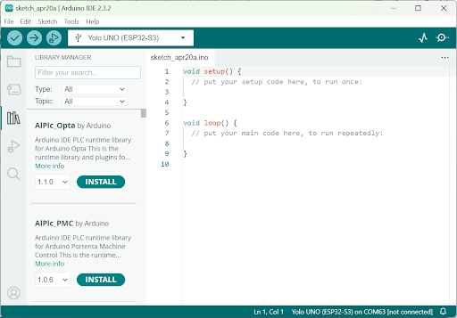

3. Cách thêm thư viện cho Arduino IDE
===========

Cách 1: Cách thêm thư viện cho Arduino IDE dùng Libraries Manager
------------
--------

Đây là cách đơn giản và tiện dụng nhất. Bạn vào **Sketch > Include Libraries > Manage Libraries…** để mở cửa sổ Library Manager. Bạn **gõ tên thư viện muốn cài đặt** và chọn **Install**.

|

Sau khi thư viện được cài đặt, bạn có thể thấy thư viện được xuất hiện trong danh sách các thư viện của Arduino.

Bạn có thể mở file code mẫu của thư viện để tham khảo cách sử dụng từ menu **File > Examples > Tên thư viện**.

Cách 2: Cách thêm thư viện cho Arduino IDE từ file .zip
------------
--------

Nếu bạn thấy cách trên quá rắc rối, thì bạn có thể áp dụng cách thêm thư viện cho Arduino từ **file .zip**. Rất nhiều thư viện cho Arduino được chia sẻ ở trang web `<http://github.com>`_. Đây là trang web chứa các dự án mã nguồn mở cực kỳ phổ biến và bạn dễ dàng download toàn bộ file về dưới dạng **.zip**.

Ví dụ thư viện làm việc với led đèn đa màu RGB được chia sẻ ở link `<https://github.com/adafruit/Adafruit_NeoPixel>`_. Khi bạn vào trang này, bạn có thể click vào nút Clone or download và chọn Download ZIP.

Sau khi tải file zip của thư viện về, bạn vào **Sketch > Include Library > Add .ZIP Library…** sau đó chọn file vừa tải về để cài đặt.
