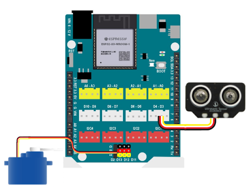
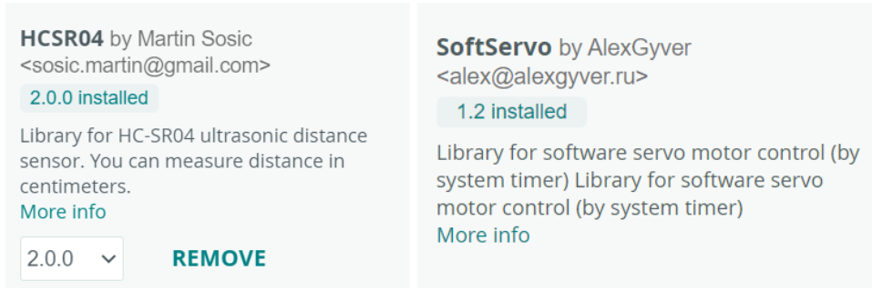

13. Thùng rác thông minh
==========

1. Mục tiêu
---------
---------

Chương trình này sẽ đọc khoảng cách bằng cảm biến siêu âm để phát hiện có người đứng trước thùng rác hay không. Nếu có thì sẽ quay servo để mở nắp thùng rác và đóng lại sau 3 giây.

2. Kết nối 
-----
---------

Kết nối cảm biến siêu âm ở cổng D3-D4, động cơ servo kết nối cổng D2.

|

3. Chương trình Arduino
------
-------

Bạn cần cài đặt thư viện **HCSR04** và **SoftServo**:

|

.. code-block:: arduino

    #include <Arduino.h>
    #include "HCSR04.h";
    #include "SoftServo.h";

    UltraSonicDistanceSensor ultrasonic(D3, D4); //cảm biến nối với D3-D4
    SoftServo myservo;

    void setup() {
        myservo.attach(D2); // servo nối với cổng D2
        myservo.asyncMode();
        myservo.delayMode();

        myservo.tick();
        myservo.write(90);
    }

    void loop() {
        if ((ultrasonic.measureDistanceCm() < 10)) {
            myservo.tick();
            myservo.write(180);
            delay(3000);
            myservo.tick();
            myservo.write(90);
        } else {
            myservo.tick();
            myservo.write(90);
        }
    }