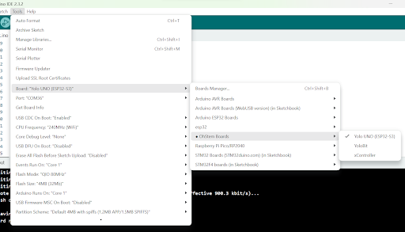

2. Upload code trong Arduino IDE
===========

Để có thể upload code cho ESP32-S3 lần đầu trên Arduino, bạn cần đưa vào chế độ bootloader. Chế độ này là một phần mềm nhỏ được lưu trữ trong bộ nhớ flash, chịu trách nhiệm khởi động chip và tải ứng dụng người dùng từ bộ nhớ flash hoặc qua OTA (cập nhật qua mạng). 

Bạn thao tác bằng cách sau để vào mode bootloader:

1. Nhấn giữ nút Boot có trên mạch Yolo UNO
2. Đồng thời nhấn nút Reset và thả ra sau 1 giây để reset lại mạch
3. Sau bước trên khoảng 2 giây thì thả nút Boot ra

Trên Arduino IDE, bạn chọn đúng loại board là Yolo UNO và cổng COM tương ứng với port mà Arduino IDE nhận được và nhấn nút Upload. 

|

Để biên dịch và upload code, Arduino IDE có thể cần khoảng 20-30 giây cho lần đầu tiên và sẽ nhanh hơn cho những lần biên dịch sau.

Sau khi upload thành công, bạn sẽ thấy đèn led onboard của Yolo UNO chớp tắt mỗi giây. Bạn có thể sửa lại thời gian delay từ 1000 thành 500 hoặc số tùy ý và upload lại và quan sát sự thay đổi.

Ở các lần upload sau đó thì bạn không cần phải làm thao tác đưa mạch Yolo UNO vào bootloader mode nữa.
