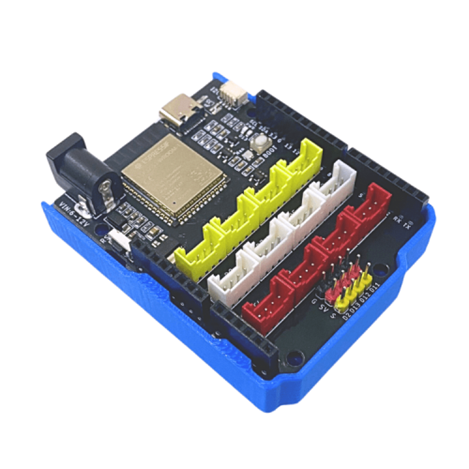
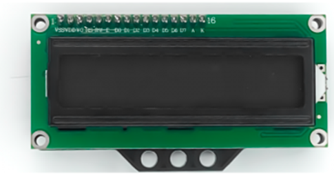
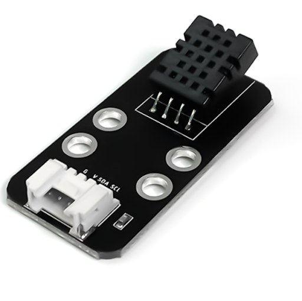
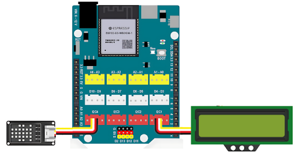
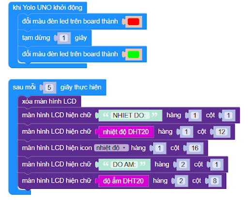

2. Đo nhiệt độ và độ ẩm bên trong nhà kính
=================================

1. Mục tiêu
-----
--------

Theo dõi các thông số nhiệt độ và độ ẩm không khí thu được từ cảm biến DHT20 và hiển thị lên màn hình LCD 1602.

2. Thiết bị cần sử dụng
---------
----------

- Mạch Yolo UNO:

|

- Module LCD1602 kèm dây tín hiệu: 

|

- Cảm biến nhiệt độ độ ẩm DHT20 kèm dây tín hiệu:

|

3. Kết nối phần cứng
-------
--------

- Kết nối LCD vào cổng I2C1

- Kết nối cảm biến DHT20 vào cổng I2C4 của Yolo UNO

|

4. Chương trình lập trình
------
------

- **Giới thiệu khối lệnh:** Khối lệnh dùng để đọc thông số nhiệt độ hoặc độ ẩm của cảm biến DHT20

|

- **Chương trình lập trình:**

    Link chương trình `<https://app.ohstem.vn/#!/share/yolouno/2s1Of1S2hfCES5PQOQZogHUMrQc>`_

- **Giải thích chương trình:**  Sau khi cấp điện, mạch Yolo UNO sẽ hiển thị đèn led màu trên bo từ đỏ sang xanh lá cây. Sau mỗi 5s, thông tin nhiệt độ độ ẩm sẽ được cập nhật và hiển thị trên màn hình LCD, dựa vào thông tin đó chúng ta sẽ biết được nhiệt độ và độ ẩm trong nhà kín.