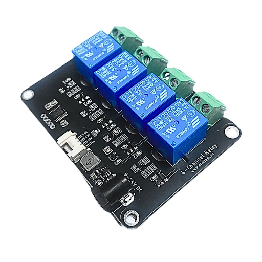
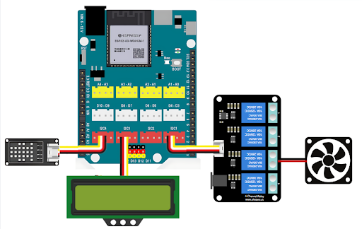

3. Bật quạt tự động dựa trên nhiệt độ
=================================

1. Mục tiêu
-----
--------

Bật tắt quạt sử dụng Relay 4 kênh để duy trì nhiệt độ lý tưởng bên trong nhà kính.

2. Thiết bị cần sử dụng
---------
----------

- Mạch Yolo UNO:

..  image:: images/yolouno.png
    :scale: 50%
    :align: center 
|

- Relay 4 kênh kèm dây tín hiệu: 

|

- Quạt:

|

3. Kết nối phần cứng
-------
--------

- Kết nối Relay vào cổng I2C3

- Kết nối quạt vào cổng Relay 3

|

4. Chương trình lập trình
------
------

- **Tải thư viện Relay 4 kênh**: 

    Vào mục **Mở rộng** và dán link sau vào ô tìm kiếm: `<https://github.com/AITT-VN/yolouno_extension_relay4ch>`_

    Xem hướng dẫn tải thư viện `tại đây <https://docs.ohstem.vn/en/latest/module/thu-vien-yolouno.html>`_.

..  image:: images/bai_2.2.png
    :scale: 80%
    :align: center 
|

- **Giới thiệu khối lệnh:** Các khối lệnh để bật tắt hoặc đọc trạng thái của relay 4 kênh

|

- **Chương trình lập trình:**

    Link chương trình `<https://app.ohstem.vn/#!/share/yolouno/2s1QKj4FMj0IjAhbcgswJleztaw>`_

- **Giải thích chương trình:** Sau khi cấp điện, mạch Yolo UNO sẽ hiển thị đèn led màu trên bo từ đỏ sang xanh lá cây. Sau mỗi 5s, thông tin nhiệt độ độ ẩm sẽ được cập nhật và hiển thị trên màn hình LCD, dựa vào thông tin đó chúng ta sẽ biết được nhiệt độ và độ ẩm trong nhà kín và cùng thời điểm này Yolo UNO cũng sẽ so sánh nhiệt độ với ngưỡng cài đặt để tiến hành bật quạt khi nhiệt độ cao, tắt quạt khi nhiệt độ thấp.
