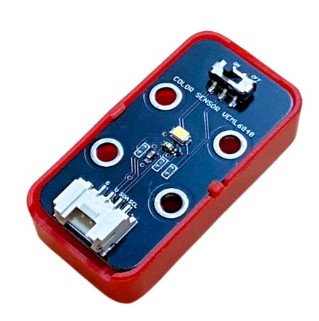

4. Đo và hiển thị độ sáng của ngôi nhà
=================================

1. Mục tiêu
-----
--------

Đọc thông số độ sáng ngôi nhà từ cảm biến ánh sáng VEML 6040 và hiển thị lên màn hình LCD 1602.

2. Thiết bị cần sử dụng
---------
----------

- Mạch Yolo UNO:

..  image:: images/yolouno.png
    :scale: 50%
    :align: center 
|

-  Module LCD kèm dây tín hiệu:

..  image:: images/lcd1602.png
    :scale: 50%
    :align: center 
|

- Cảm biến nhiệt ánh sáng và màu sắc VEML 6040 kèm dây tín hiệu:

|

3. Kết nối phần cứng
-------
--------

- Kết nối LCD 1602 vào cổng I2C1

- Kết nối cảm biến VEML 6040 vào cổng I2C2 của Yolo UNO

..  figure:: images/bai_3.1.png
    :scale: 80%
    :align: center 
|

4. Chương trình lập trình
------
------

- **Tải thư viện Cảm biến ánh sáng và màu sắc VEML6040**: 

    Vào mục **Mở rộng** và dán link sau vào ô tìm kiếm `<https://github.com/AITT-VN/yolouno_extension_veml6040>`_

    Xem hướng dẫn tải thư viện `tại đây <https://docs.ohstem.vn/en/latest/module/thu-vien-yolouno.html>`_.

|

- **Giới thiệu khối lệnh:** 

    + Khối lệnh đọc giá trị độ sáng môi trường:

    ..  image:: images/bai_3.3.png
        :scale: 50%
        :align: center 
    |

    + Khối lệnh phát hiện màu sắc:

    ..  image:: images/bai_3.4.png
        :scale: 50%
        :align: center 
    |

- **Chương trình lập trình:**

    Link chương trình `<https://app.ohstem.vn/#!/share/yolouno/2s1SyTNuFDFyl5Oxxt5xiXU2aKW>`_

- **Giải thích chương trình:** Sau khi cấp điện, đèn led trên Yolo UNO sẽ chuyển từ đỏ sang xanh lá cây. Sau 3s, màn hình sẽ cập nhật độ sáng và hiển thị trên màn hình LCD