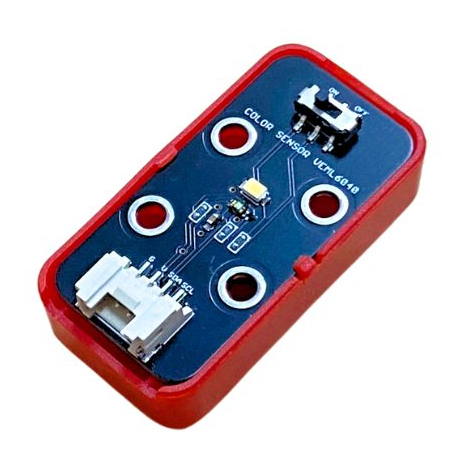
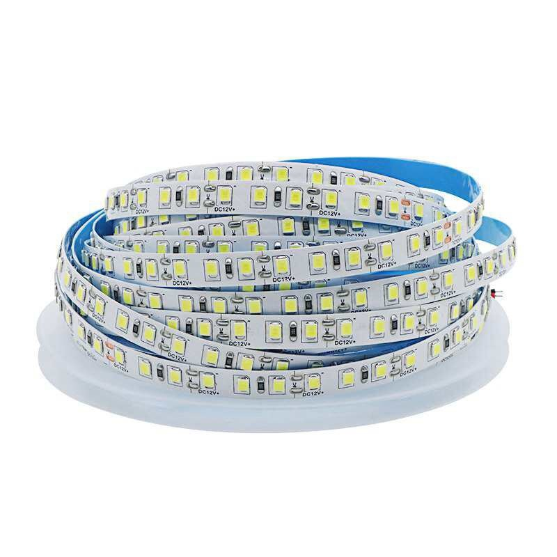
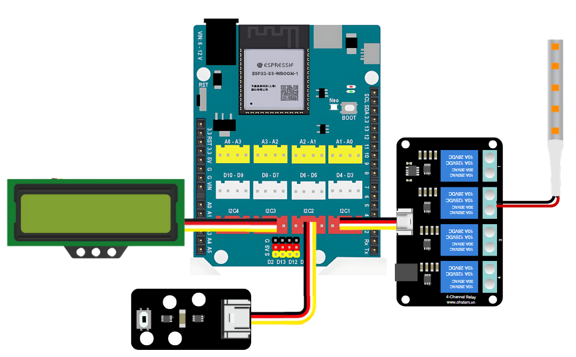
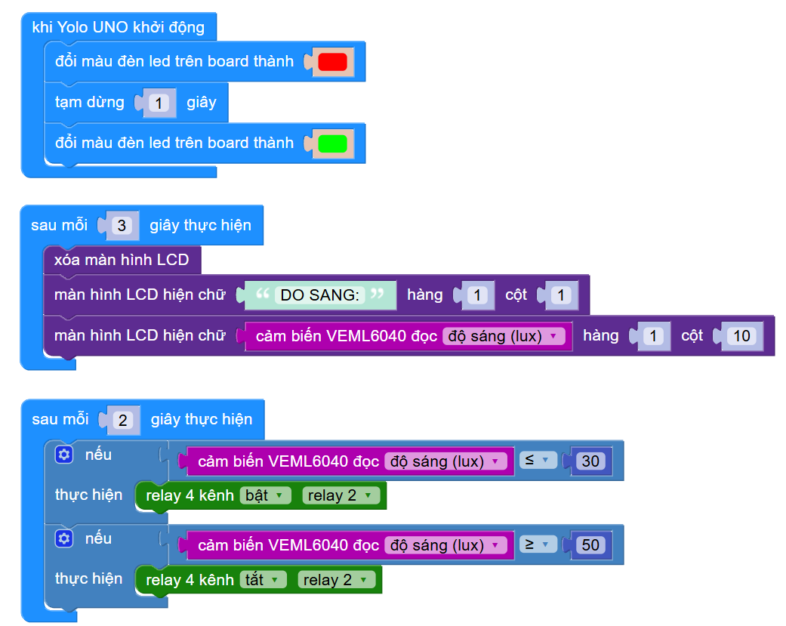

5. Bật tắt đèn tự động dựa trên ánh sáng
=================================

1. Mục tiêu
-----
--------

Sau khi đã hiển thị được thông tin độ sáng lên màn hình LCD, chúng ta sẽ tiến hành điều khiển đèn bật tắt tự động theo độ sáng của cảm biến.

2. Thiết bị cần sử dụng
---------
----------

- Mạch Yolo UNO:

..  image:: images/yolouno.png
    :scale: 50%
    :align: center 
|

- Module LCD1602 kèm dây tín hiệu: 

..  image:: images/lcd1602.png
    :scale: 50%
    :align: center 
|

- Cảm biến ánh sáng VEML6040 kèm dây tín hiệu:

|

- Module Relay 4 kênh kèm dây tín hiệu:

..  image:: images/relay_4_kenh.png
    :scale: 50%
    :align: center 
|

- Đèn kích thích sinh trưởng:

|

3. Kết nối phần cứng
-------
--------

- Nối đèn kích thích sinh trưởng vào relay số 2 trên mạch Relay 4 kênh

- Cảm biến ánh sáng và màn hình vẫn cắm ở vị trí khe mở rộng I2C.

|

4. Chương trình lập trình
------
------

Chúng ta sẽ so sánh độ sáng với 2 ngưỡng để thực hiện việc bật tắt đèn sinh trưởng ở relay số 2. Sau mỗi 2s, cảm biến sẽ được kiểm tra 1 lần và thao tác bật tắt đúng theo điều kiện ngưỡng. 

    Link chương trình `<https://app.ohstem.vn/#!/share/yolouno/2s1TQGfnOdhlSAzlY8bgNyAk85r>`_
