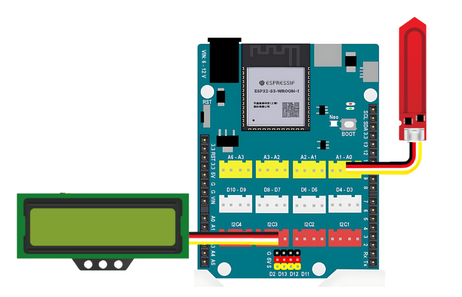
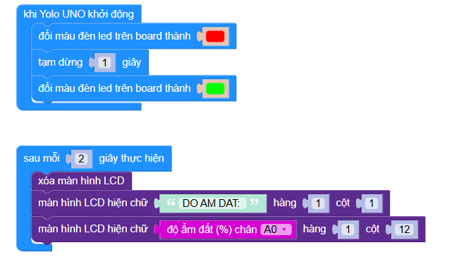

6. Đo và hiển thị độ ẩm của đất
=================================

1. Mục tiêu
-----
--------

Đọc thông số độ sáng ngôi nhà từ cảm biến Cảm biến độ ẩm đất điện dung và hiển thị lên màn hình LCD 1602.

2. Thiết bị cần sử dụng
---------
----------

- Mạch Yolo UNO:

..  image:: images/yolouno.png
    :scale: 50%
    :align: center 
|

- Module LCD1602 kèm dây tín hiệu: 

..  image:: images/lcd1602.png
    :scale: 50%
    :align: center 
|

- Cảm biến độ ẩm đất kèm dây tín hiệu: 

..  image:: images/do_am_dat.png
    :scale: 60%
    :align: center 
|

3. Kết nối phần cứng
-------
--------

- Kết nối cảm biến độ ẩm đất vào cổng A0 của Yolo UNO

- Giữ nguyên kết nối màn hình LCD 1602 ở chân I2C3

|

4. Chương trình lập trình
------
------

- **Giới thiệu khối lệnh:**

    Khối lệnh đọc giá trị độ ẩm đất. Trong đó, A0 là chân cắm cảm biến độ ẩm đất

    ..  image:: images/bai_5.2.png
        :scale: 60%
        :align: center 
    |

- **Chương trình lập trình:**

    Link chương trình `<https://app.ohstem.vn/#!/share/yolouno/2s1U02brCrC0dYkV6QxJ3ElxygW>`_

- **Giải thích chương trình:** Sau khi cấp điện, mạch Yolo UNO sẽ hiển thị đèn led màu trên bo từ đỏ sang xanh lá cây. Sau 2s, màn hình sẽ cập nhật độ ẩm đất và hiển thị trên màn hình LCD
