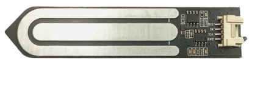
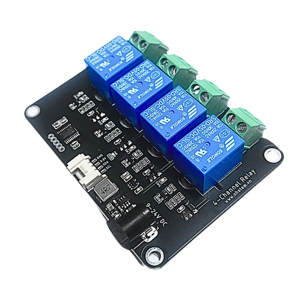
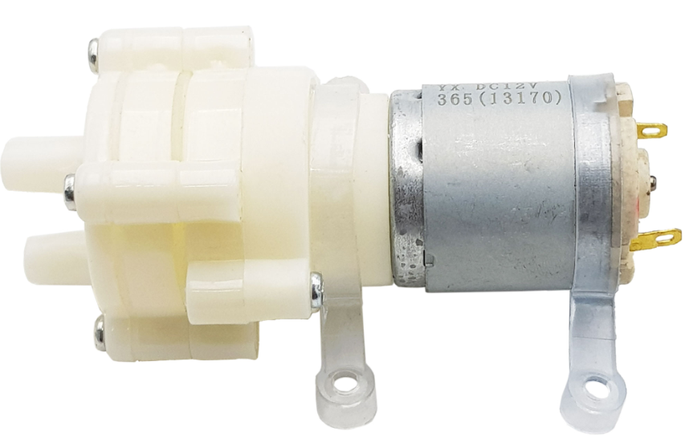
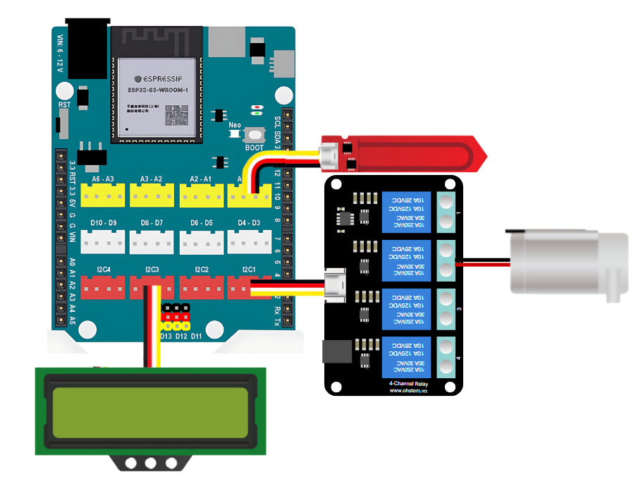
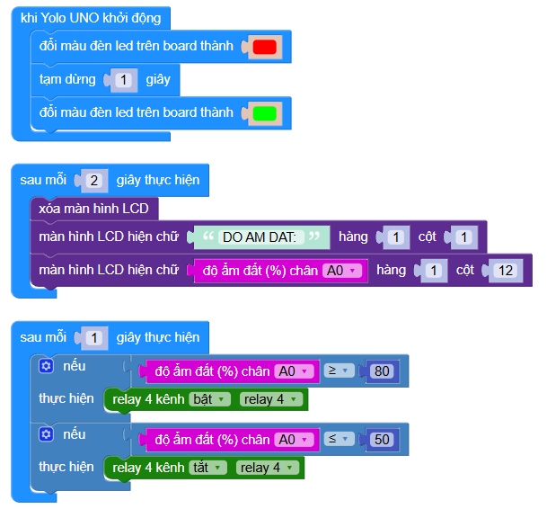

7. Bật tắt máy bơm tự động
=================================

1. Mục tiêu
-----
--------

Đọc thông số độ sáng ngôi nhà từ cảm biến Cảm biến độ ẩm đất điện dung và hiển thị lên màn hình LCD 1602, dựa vào thông số cảm biến trả về sẽ bật tắt máy bơm nước qua relay 4 của mạch Relay 4 kênh

2. Thiết bị cần sử dụng
---------
----------

- Mạch Yolo UNO:

..  image:: images/yolouno.png
    :scale: 50%
    :align: center 
|

- Module LCD1602 kèm dây tín hiệu: 

..  image:: images/lcd1602.png
    :scale: 50%
    :align: center 
|

- Cảm biến độ ẩm đất điện dung kèm dây tín hiệu:

|

- Module Relay 4 kênh kèm dây tín hiệu:

|

- Máy bơm nước: 

|

3. Kết nối phần cứng
-------
--------

- Nối máy bơm vào relay số 4 trên mạch Relay 4 kênh
- Cảm biến độ ẩm đất vào cổng A0
- Màn hình LCD1602 và Relay 4 kênh vẫn cắm ở vị trí khe mở rộng I2C.

|

4. Chương trình lập trình
------
------

Tương tự các tính năng khác, chúng ta sẽ cho máy bơm hoạt động dựa trên thông tin từ cảm biến độ ẩm đất. Cảm biến độ ẩm đất sẽ hoạt động ngược với cảm biến độ ẩm đất bằng điện trở nên ngưỡng so sánh sẽ ngược với cảm biến độ ẩm đất điện dung (giá trị % cao là đất khô, giá trị % thấp là đất ướt).

    Link chương trình `<https://app.ohstem.vn/#!/share/yolouno/2s1UJDhma9iu6m2tYLcHg0dWkaH>`_
