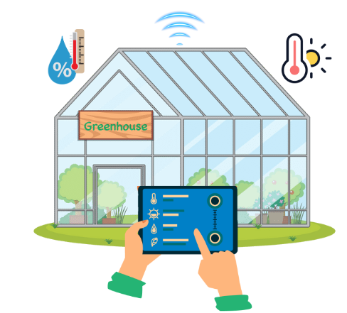

1. Giới thiệu
=================================

Green House là mô hình nhà kính thông minh được thiết kế nhằm giúp học sinh khám phá và phát triển các tính năng công nghệ hiện đại phục vụ trong lĩnh vực nông nghiệp trồng trọt.

    *Dự án nhà kính thông minh Green House*

Dự án này tích hợp phương pháp lập trình kéo thả đơn giản, giúp học sinh dễ dàng tự tay lập trình và nắm vững các kỹ năng công nghệ cơ bản. Qua đó, các em có thể mở rộng kiến thức, nghiên cứu sâu hơn về nông nghiệp thông minh và góp phần thúc đẩy sự sáng tạo trong lĩnh vực này.

**Các tính năng nổi bật của Green House:**

Dự án sẽ hướng dẫn bạn xây dựng và triển khai một số chức năng thông minh hỗ trợ hiệu quả cho việc trồng trọt, bao gồm:

1. **Đo nhiệt độ và độ ẩm bên trong nhà kính:** Theo dõi và hiển thị thông số môi trường.
2. **Bật quạt tự động dựa trên nhiệt độ:** Duy trì nhiệt độ lý tưởng trong nhà kính.
3. **Đo và hiển thị độ sáng:** Theo dõi mức độ ánh sáng bên trong nhà kính để đảm bảo cây nhận đủ ánh sáng cần thiết.
4. **Bật tắt đèn tự động dựa trên ánh sáng:** Điều chỉnh ánh sáng phù hợp cho cây trồng.
5. **Đo và hiển thị độ ẩm của đất:** Cung cấp thông tin về tình trạng đất trồng.
6. **Bật tắt máy bơm nước tự động dựa vào độ ẩm của đất:** Tối ưu hóa việc tưới tiêu, tiết kiệm nước và công sức.

Với Green House, học sinh không chỉ học cách vận dụng công nghệ mà còn hiểu rõ hơn về vai trò của sự đổi mới trong nông nghiệp, mở ra những giải pháp bền vững cho tương lai.

