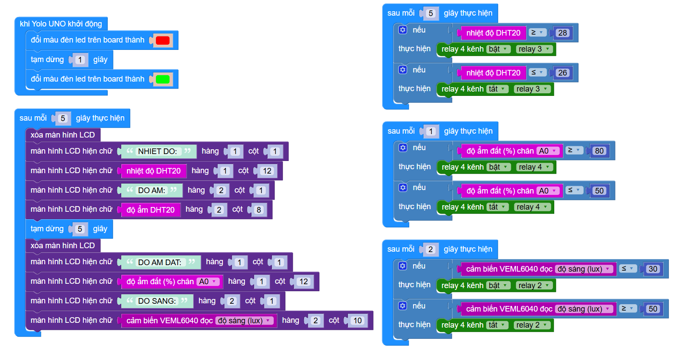

8. Tổng hợp dự án
============

Tổng hợp lại các tính năng cơ bản của mô hình ta có:

- Bật/tắt quạt tự động dựa trên cảm biến nhiệt độ độ ẩm DHT20
- Bật tắt đèn thông tự động dựa trên cảm biến ánh sáng VEML 6040
- Bật tắt máy bơm dựa trên cảm biến độ ẩm đất điện dung

**1. Hướng dẫn kết nối phần cứng cho dự án**
-----------
--------

- Kết nối các module với Yolo UNO:

..  csv-table:: 
    :header: "STT", "Module", "Chân cắm trên Yolo UNO"
    :widths: 10, 20, 15

    1, "Relay 4 kênh", "I2C1"
    2, "Cảm biến ánh sáng VEML6040", "I2C2"
    3, "Màn hình LCD 1602", "I2C3"
    4, "Cảm biến DHT20", "I2C4"
    5, "Cảm biến độ ẩm đất điện dung", "A0"

- Kết nối các thiết bị với đầu ra của Relay:

..  csv-table:: 
    :header: "STT", "Module", "Chân cắm trên Relay 4 kênh"
    :widths: 10, 20, 15

    1, "Đèn", "Relay số 2"
    2, "Quạt", "Relay số 3"
    3, "Máy bơm", "Relay số 4"

2. Chương trình tổng
-----------
-------

    Link chương trình `<https://app.ohstem.vn/#!/share/yolouno/2vsqZvNfyWykyVhJrs0XWdOaFVU>`_