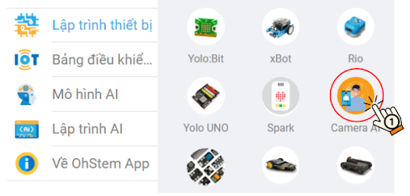
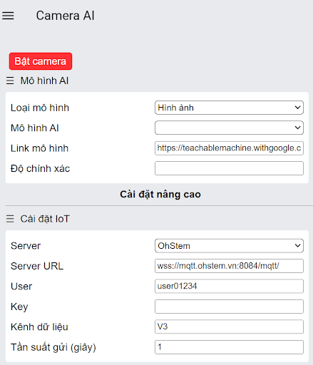
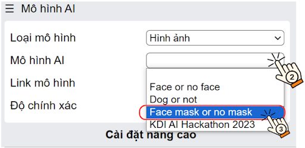
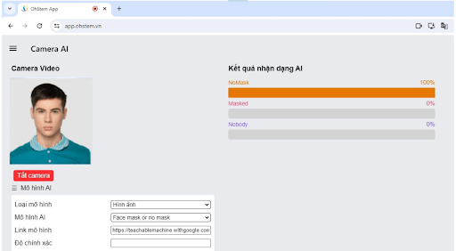
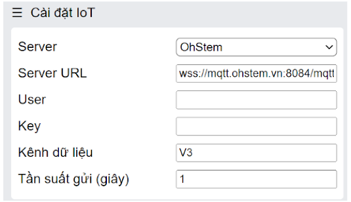
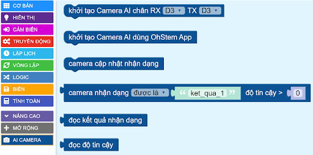
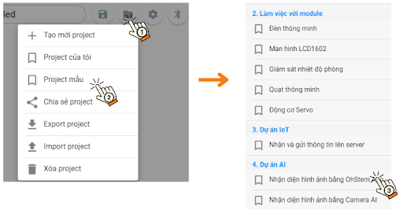
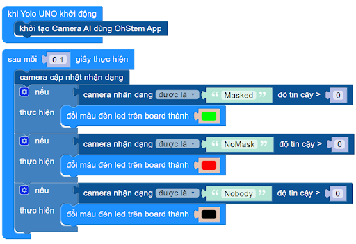

13. Nhận diện hình ảnh bằng OhStem App
=========

1. Mục tiêu
-----
--------

Với hướng dẫn này, chúng ta sẽ thực hiện dự án nhận diện hình ảnh, Yolo UNO sẽ bật đèn xanh nếu phát hiện có mang khẩu trang, bật đèn đỏ nếu không đeo khẩu trang. Ngược lại, thì tắt đèn. 

2. Thiết bị cần sử dụng
---------
----------

- Mạch Yolo UNO:

..  image:: images/yolo_uno.png
    :scale: 60%
    :align: center 
|

3. Huấn luyện mô hình AI
-------
--------

Với dự án này, chúng ta sẽ sử dụng mô hình có sẵn trên thiết bị Camera AI của OhStem App. Các bước thực hiện như sau: 

**Bước 1**: Vào `<https://app.ohstem.vn/>`_. Chọn thiết bị **Camera AI**:

|

**Bước 2**: Giao diện được hiển thị như hình: 

|

**Bước 3**: Ở mục **Mô hình AI**, nhập link mô hình của bạn đã tạo hoặc có thể dùng một trong các mô hình có sẵn để thử nghiệm. (Xem cách  tạo mô hình `tại đây <https://www.notion.so/robotics-ai/H-ng-d-n-Hu-n-luy-n-m-h-nh-AI-1ec23fb527d04f4ea8aa9aa716bc3b35?pvs=4>`_):

Với hướng dẫn này, chọn mô hình **Face mask or no mask** (Có khẩu trang hoặc không khẩu trang)

|

**Bước 4**: Chọn nút **Bật camera** để kiểm tra kết quả nhận diện: 

|

**Đối với phần cài đặt IoT**, nếu muốn gửi kết quả nhận dạng lên Internet thì thực hiện việc tạo bảng điều khiển, khai báo User và kênh dữ liệu. Nếu chỉ cần thiết bị xử lý bằng USB hay Bluetooth có thể bỏ qua bước này.

|

4. Chương trình lập trình
------
------

**4.1 Tải thư viện**
----------

Vào mục **Mở rộng** của **Yolo UNO**, tải thư viện **Camera AI**: 

..  figure:: images/ai_ohstem_6.png
    :scale: 100%
    :align: center 
|    

Các khối lệnh của danh mục khối lệnh Camera AI: 

|

**4.2 Viết chương trình**
----------

Thực hiện các thao tác sau để mở chương trình **Nhận diện hình ảnh bằng OhStem App**:

|

Chương trình hiển thị như sau: 

|

**4.3 Giải thích chương trình**
----------

Khi Yolo UNO khởi động, Camera AI trên OhStem App sẽ được khởi tạo. Sau 0.1 giây, kết quả nhận dạng từ camera sẽ liên tục cập nhật: 

- Nếu camera nhận dạng được có đeo khẩu trang thì đổi đèn led thành xanh

- Nếu camera nhận dạng được không đeo khẩu trang thì đổi đèn led thành đỏ

- Nếu camera không phát hiện được 2 kết quả trên thì tắt đèn. 

