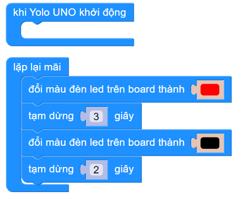

4. Bật tắt đèn LED trên board
==========

1. Mục tiêu 
------
------

Để làm quen với Yolo UNO, trong bài này, chúng ta sẽ lập trình cho Yolo UNO bật tắt đèn LED trên board sau mỗi giây.

2. Thiết bị cần sử dụng
---------
------------

- Mạch Yolo UNO:

..  image:: images/yolo_uno.png
    :scale: 60%
    :align: center 

3. Chương trình lập trình
------
--------

- **Giới thiệu khối lệnh:**

..  image:: images/bat_tat_den_1.png
    :scale: 100%
    :align: center 

Câu lệnh dùng để thay đổi màu đèn led RGB trên board, màu đen dùng để tắt đèn.

- **Chương trình lập trình:**

..  image:: images/bat_tat_den_2.png
    :scale: 90%
    :align: center 
|

Có thể thay đổi thời gian sáng tắt của đèn led để tạo các hiệu ứng khác nhau:

|

4. Chương trình mẫu
----
-----

Nhấp vào chữ tại đây để xem chương trình mẫu, hoặc quét mã QR bên dưới để xem chương trình.

Bật tắt đèn LED trên board: `Tại đây <https://app.ohstem.vn/#!/share/yolouno/2ciAWS5HFG4ud8KbL3COyrJ280F>`_

|
