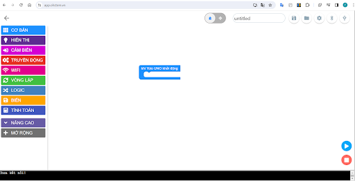

3. Các thao tác với Yolo UNO trên OhStem App
============

**1. Truy cập vào OhStem App**
------------
--------

**Bước 1:** Truy cập vào link `app.ohstem.vn <https://app.ohstem.vn/>`_ :

|

**Bước 2:** Chọn thiết bị lập trình là **Yolo UNO**

..  image:: images/co_ban_2.png
    :scale: 100%
    :align: center 
|

**Bước 3:** Chọn vào **Lập trình**:

|

**Bước 4:** 
    - Kết nối Yolo UNO vào máy tính và phần mềm lập trình
    - Kết nối dây USB type C với Máy tính và Yolo UNO.

|
    
    - Chọn icon kết nối có dây/ Bluetooth → chọn cổng COM/ thiết bị có tên gần giống là **Espressif CDC Device (COMxx)** → nhấn nút Kết nối. (*Số thứ tự của cổng COM có thể là khác nhau trên mỗi máy tính.*)

..  image:: images/co_ban_5.png
    :scale: 100%
    :align: center 
|

Khi kết nối thành công biểu tượng USB sẽ sáng đèn màu xanh:

..  image:: images/co_ban_6.png
    :scale: 100%
    :align: center 
|

**2. Xem chương trình mẫu**
------
--------

**Bước 1:** Chọn vào biểu tượng thư mục trên thanh công cụ và chọn **Project mẫu**: 

..  image:: images/co_ban_7.png
    :scale: 100%
    :align: center 
|

**Bước 2:** Chọn vào tên project để mở chương trình mẫu: 

..  image:: images/co_ban_8.png
    :scale: 100%
    :align: center 
|

**Bước 3:** Chương trình mẫu sẽ hiển thị trên màn hình, bạn chỉ cần nhấn nút chạy chương trình. (Nếu chưa kết nối thực hiện lại nội dung 1)

..  image:: images/co_ban_9.png
    :scale: 100%
    :align: center 
|