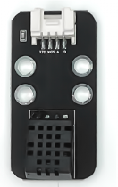
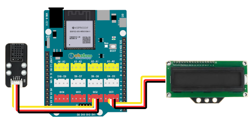
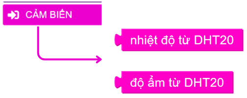
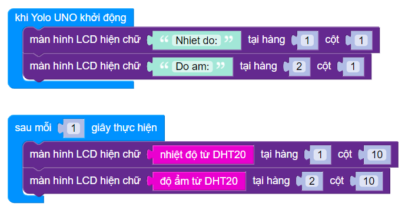

9. Máy đo nhiệt độ độ ẩm
============

1. Mục tiêu
-----
--------

Đọc thông số nhiệt độ và độ ẩm không khí từ cảm biến DHT20 và hiển thị lên màn hình LCD 1602.

2. Thiết bị cần sử dụng
---------
----------

- Mạch Yolo UNO:

..  image:: images/yolo_uno.png
    :scale: 60%
    :align: center 
|

- Module led RGB kèm dây tín hiệu: 

..  image:: images/lcd_1602.png
    :scale: 90%
    :align: center 
|

- Cảm biến nhiệt độ độ ẩm DHT20 kèm dây tín hiệu:

|

3. Kết nối phần cứng
-------
--------

- Kết nối LCD vào cổng I2C1

- Kết nối cảm biến DHT20 vào cổng I2C2 của Yolo UNO

|

4. Chương trình lập trình
------
------

- **Giới thiệu khối lệnh:**

|
    
Các khối lệnh để đọc thông số nhiệt độ hoặc độ ẩm của cảm biến DHT20

- **Chương trình lập trình:**

|

5. Chương trình mẫu
----
-----

Nhấp vào chữ tại đây để xem chương trình mẫu, hoặc quét mã QR bên dưới để xem chương trình.

Máy đo nhiệt độ độ ẩm: `Tại đây <https://app.ohstem.vn/#!/share/yolouno/2aLiYvpF4SZASvZf8gGk3UqEH98>`_

|
