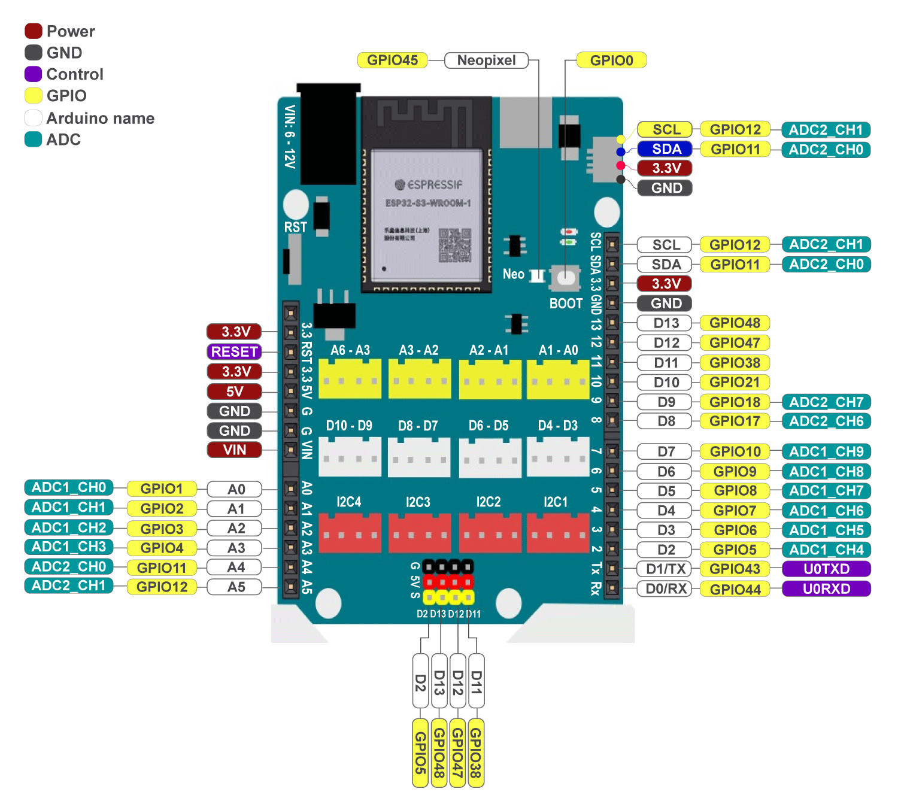

1. Giới thiệu về Yolo UNO 
=========================================

..  image:: images/yolo_uno.png
    :scale: 80%
    :align: center 
|

Yolo UNO là mạch lập trình được thiết kế theo form của Arduino Uno với chip ESP32-S3 là dòng chip mới nhất của Espressif, với bộ nhớ flash có dung lượng 4MB và bộ nhớ PSRAM lên đến 8MB.

Ngoài kích thước và sơ đồ chân tương thích hoàn toàn với mạch Arduino Uno truyền thống, Yolo UNO còn có tích hợp sẵn 12 cổng kết nối chuẩn Grove, giúp dễ dàng sử dụng với các module và cảm biến trong hệ sinh thái thiết bị AI/IoT của OhStem.

1. Mua sản phẩm
-----------
----------

..  image:: images/gio.png
    :alt: some image
    :target: https://ohstem.vn/product/yolo-uno/
    :class: with-shadow
    :scale: 100%
    :align: center
|

2. Sơ đồ chân của Yolo UNO
-----
-------

|

3. Thông số kỹ thuật
-------
-------

- ESP32-S3 Dual Core 240MHz Tensilica, 4MB Flash, 8MB PSRAM, tích hợp native USB
- 2.4GHz Wifi - 802.11b/g/n
- Bluetooth 5, BLE + Mesh
- Cấp nguồn qua cổng USB type C hoặc Jack DC 5521 (tối đa 12V)
- 2 nút nhấn onboard:
    + Reset
    + Bootloader mode (BOOT0)
- 12 cổng kết nối chuẩn Grove:
    + 4 x Analog
    + 4 x Digital
    + 4 x I2C
    + 4 chân cắm GVS giúp dễ dàng giao tiếp các loại động cơ Servo
- Cổng kết nối chuẩn STEMMA QT/QWIIC connector cho các module I2C
- Tích hợp đèn LED báo nguồn, LED chân D13 và LED RGB NeoPixel
- Hỗ trợ lập trình bằng khối lệnh kéo thả, Arduino, Micropython hoặc ESP-IDF

