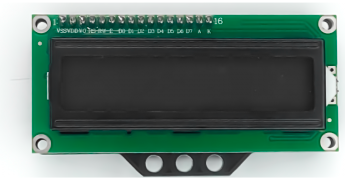
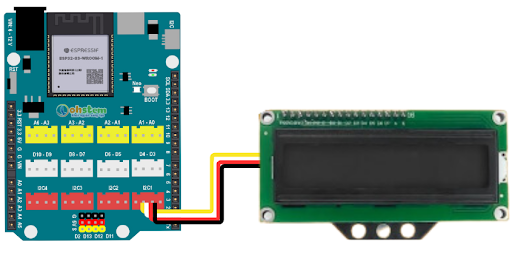
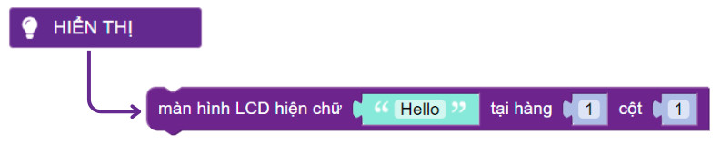
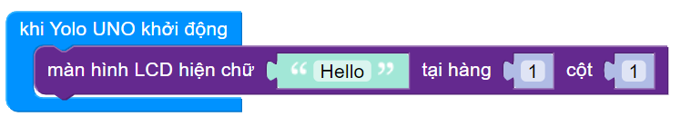
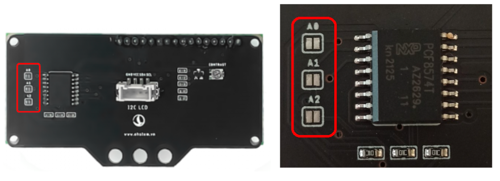
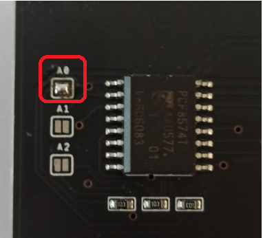
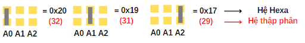
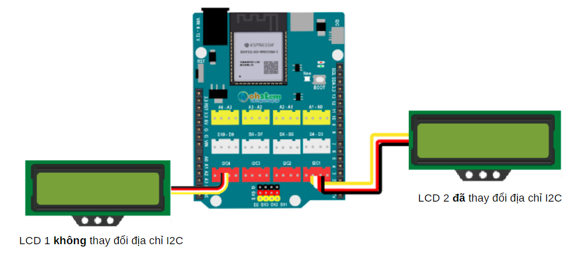
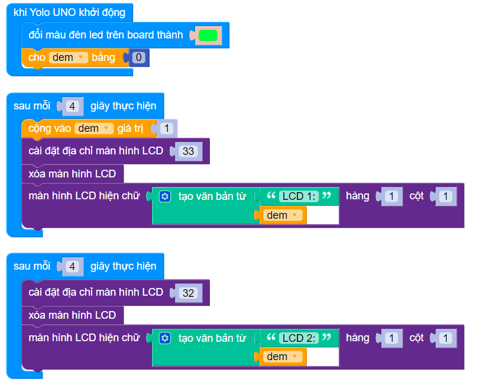
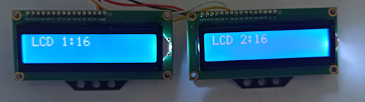

8. Hiển thị chữ "Hello" lên màn hình LCD 1602
======

1. Mục tiêu
-----
--------

Làm quen mới module LCD 16x2 để hiện thị các thông tin dạng ký tự 

2. Thiết bị cần sử dụng
---------
----------

- Mạch Yolo UNO:

..  image:: images/yolo_uno.png
    :scale: 60%
    :align: center 
|

- Module led RGB kèm dây tín hiệu: 

|

3. Kết nối phần cứng
-------
--------

- Kết nối màn hình LCD 1602 với cổng I2C1 trên Yolo UNO

|

4. Chương trình lập trình
------
------

- **Câu lệnh hiển thị lên màn hình LCD:**

|

- **Chương trình lập trình:**

|

5. Chương trình mẫu
----
-----

Nhấp vào chữ tại đây để xem chương trình mẫu, hoặc quét mã QR bên dưới để xem chương trình.

Hiển thị chữ "Hello" lên màn hình LCD 1602: `Tại đây <https://app.ohstem.vn/#!/share/yolouno/2aLhIA7hTZTg3i7un0onIfXzpUE>`_

|

6. Hướng dẫn sử dụng nhiều màn hình I2C với Yolo UNO
----
-----

Để kết nối thêm nhiều màn hình LCD1602 trên mạch Yolo UNO, hãy chú ý đến các chân ở vị trí mặt sau của màn hình LCD là A0, A1, A2. Các chân này dùng để điều chỉnh địa chỉ giao tiếp của LCD. 

|

**Cách thay đổi địa chỉ I2C của màn hình LCD:**

Để sử dụng thêm các màn hình khác **bạn hãy dùng mỏ hàn chì để hàn để nối 2 đầu của 1 điểm lại với nhau để thay đổi địa chỉ I2C của màn hình**, tương tự minh họa sau:

|

**Hình trên đã nối điểm A0 lại với nhau, do đó màn hình sẽ thay đổi địa chỉ I2C thành 0x20 (theo hệ Hexa) tương đương địa chỉ 32 (hệ thập phân)**. Và mặc định địa chỉ I2C LCD của OhStem là 0x21, tương đương địa chỉ 33. 

Với 3 điểm A0, A1, A2, chúng ta sẽ có cách nối chân và địa chỉ của từng điểm như sau: 

|

Sau khi thay đổi xong, kết nối 2 màn hình LCD với Yolo UNO như sau: 

|

**Chương trình minh họa:**

    Link chương trình mẫu: `<https://app.ohstem.vn/#!/share/yolouno/2beztfKCZVhSZx83KqmAZiwOplv>`_

**Giải thích chương trình:** Sử dụng 1 biến đếm để kiểm tra sự thay đổi của màn hình sau mỗi 4 giây để đảm bảo 2 màn hình hoạt động song song ổn định. Chạy chương trình và kiểm tra thử kết quả, Yolo UNO đã dùng được 2 màn hình song song

|
