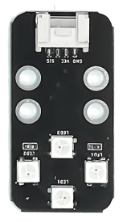
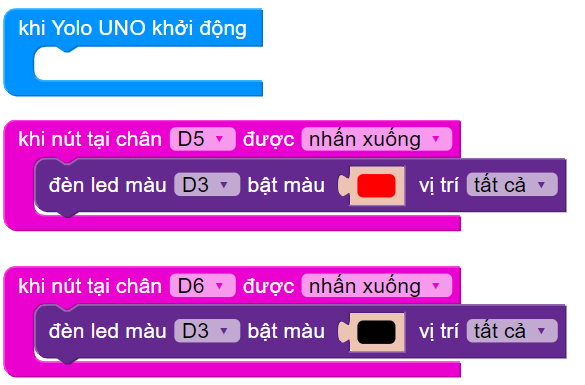

5. Bật/tắt đèn (tiny RGB) bằng nút nhấn đôi
===========

1. Mục tiêu
-----
--------

Chúng ta cùng lập trình điều khiển bật/tắt đèn led RGB bằng 2 nút nhấn trên module nút nhấn đôi.

2. Thiết bị cần sử dụng
---------
----------

- Mạch Yolo UNO:

..  image:: images/yolo_uno.png
    :scale: 60%
    :align: center 
|

- Module led RGB kèm dây tín hiệu: 

|

- Module nút nhấn đôi kèm dây tín hiệu:

|

3. Kết nối phần cứng
-------
--------

- Kết nối module Led RGB vào chân D3 - D4 của Yolo UNO

- Kết nối module Nút nhấn đôi vào chân D5 - D6 của Yolo UNO

..  image:: images/nut_nhan_doi_1.png
    :scale: 100%
    :align: center 
|

4. Chương trình lập trình
------
------

- **Giới thiệu các câu lệnh:**

|

Câu lệnh trên dùng để làm việc với nút nhấn 

- **Chương trình lập trình:**

Câu lệnh nhấn nút nhấn tại chân D6 để tắt đèn led

|

Câu lệnh nhấn nút nhấn tại chân D6 để tắt đèn led

|

Chương trình hoàn chỉnh: 

|

5. Chương trình mẫu
----
-----

Nhấp vào chữ tại đây để xem chương trình mẫu, hoặc quét mã QR bên dưới để xem chương trình.

Bật/tắt đèn (tiny RGB) bằng nút nhấn đôi: `Tại đây <https://app.ohstem.vn/#!/share/yolouno/2aLew4xvMAlzdvkL1S1Rir96LXl>`_

..  image:: images/nut_nhan_doi_6.png
    :scale: 100%
    :align: center 
|

