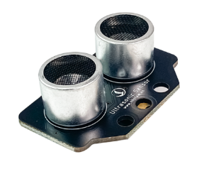
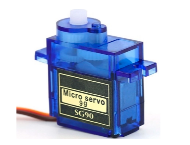
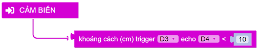
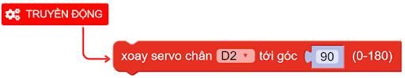
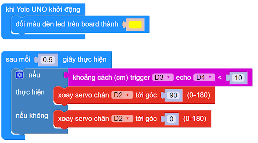

11. Thùng rác thông minh 
============

1. Mục tiêu
-----
--------

Ở hướng dẫn này, chúng ta thực hiện dự án “Thùng rác thông minh”, kết hợp cảm biến khoảng cách và động cơ servo, với chức năng tự động đóng mở khi phát hiện vật cản:

- Nếu phát hiện vật cản ở phạm vị nhỏ hơn 10cm, thì xoay servo tới góc 90 độ (mở cửa thùng rác)

- Nếu không phát hiện vật cản, thì quay servo đến góc 0 độ (đóng cửa thùng rác).

2. Thiết bị cần sử dụng
---------
----------

- Mạch Yolo UNO:

..  image:: images/yolo_uno.png
    :scale: 60%
    :align: center 
|

- Cảm biến khoảng cách kèm dây tín hiệu:  

|

- Động cơ servo 180 độ: 

|

3. Kết nối phần cứng
-------
--------

- Kết nối cảm biến siêu âm vào chân D3 - D4. 

- Kết nối động cơ servo vô cào chân D2, cần kết nối màu dây servo đúng với vị trí màu trên Yolo UNO.

..  figure:: images/thung_rac_1.png
    :scale: 100%
    :align: center 
|

4. Chương trình lập trình
------
------

- **Giới thiệu khối lệnh:**

    
    Câu lệnh so sánh kết quả nhận được của cảm biến siêu âm.

Trên cảm biến khoảng cách, chân Trigger là chân phát sóng siêu âm tới vật cản, chân Echo là thu tín hiệu sóng siêu âm phản xạ về. Nếu bạn kết nối cảm biến trên mạch mở rộng vào chân D3-D4 thì chân Trigger là D3, còn chân Echo là D4

    Câu lệnh điều khiển góc xoay của servo 180 độ

- **Chương trình lập trình:**

|

5. Chương trình mẫu
----
-----

Nhấp vào chữ tại đây để xem chương trình mẫu, hoặc quét mã QR bên dưới để xem chương trình.

Thùng rác thông minh: `Tại đây <https://app.ohstem.vn/#!/share/yolouno/2aTndblHTWVN4i72Oa48uCO6Acx>`_

|