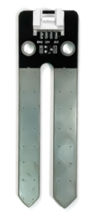
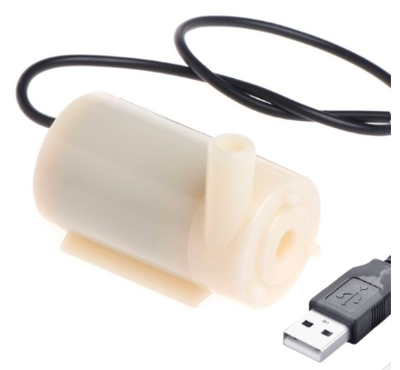
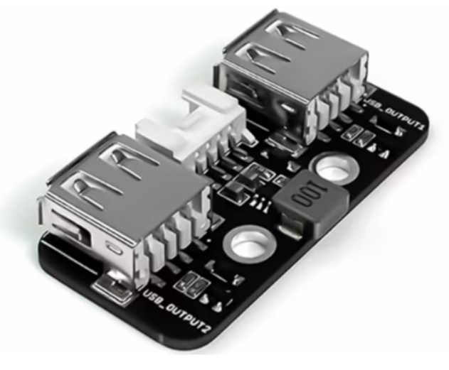
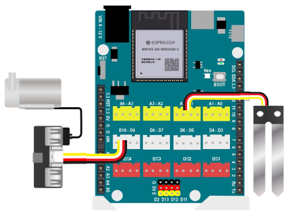
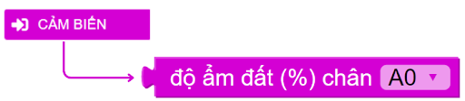
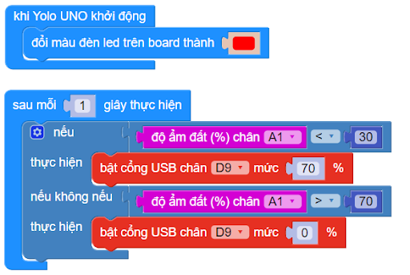

10. Vườn thông minh
=========

1. Mục tiêu
-----
--------

Với hướng dẫn này, chúng ta thực hiện dự án “Vườn thông minh” với chức năng đo độ ẩm của đất sau mỗi giây, nếu độ ẩm nhỏ hơn 30% thì sẽ bật máy bơm cho đến khi độ ẩm đạt 70%. 

2. Thiết bị cần sử dụng
---------
----------

- Mạch Yolo UNO:

..  image:: images/yolo_uno.png
    :scale: 60%
    :align: center 
|

- Cảm biến độ ẩm đất kèm dây tín hiệu: 

|

- Máy bơm mini:

|

- Module đóng ngắt 2 kênh, kèm dây tín hiệu: 

|

3. Kết nối phần cứng
-------
--------

- Kết nối cảm biến độ ẩm đất vào chân A1 - A2, do độ ẩm đất trả về giá trị Analog

- Kết nối máy bơm mini vào cổng USB_Output1 trên module đóng ngắt 2 kênh.

- Kết nối module đóng ngắt 2 kênh vào chân D9 - D10. 

|

4. Chương trình lập trình
------
------

- **Giới thiệu khối lệnh:**

|
    
*Câu lệnh bật tắt quạt với các mức độ khác nhau từ 0 đến 100 %.*

|

*Câu lệnh điều khiển thiết bị được kết nối trên Module đóng ngắt 2 kênh, ở các mức độ khác nhau từ 0 - 100%.*

Với hình kết nối trên, máy bơm được kết nối vào cổng USB 1, ở chân D9 - D10. Do đó, lập trình điều khiển máy bơm ở chân D9. 

- **Chương trình lập trình:**

|

5. Chương trình mẫu
----
-----

Nhấp vào chữ tại đây để xem chương trình mẫu, hoặc quét mã QR bên dưới để xem chương trình.

Vườn thông minh: `Tại đây <https://app.ohstem.vn/#!/share/yolouno/2aTu7jGpV6HlFsOhzy6AKYax5Xr>`_

|