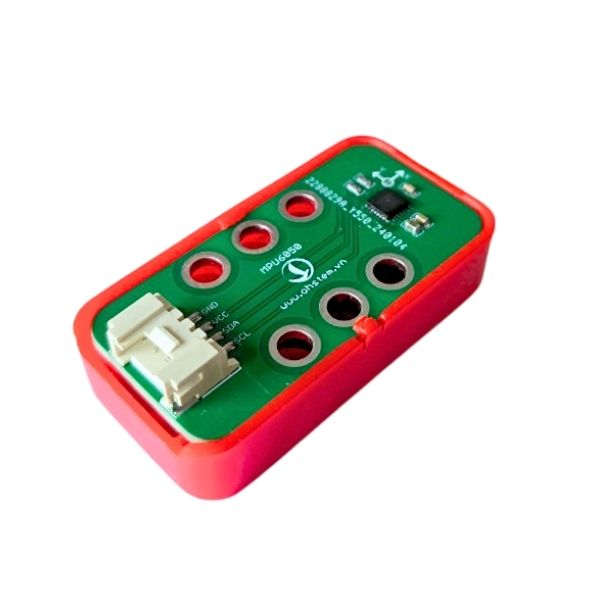
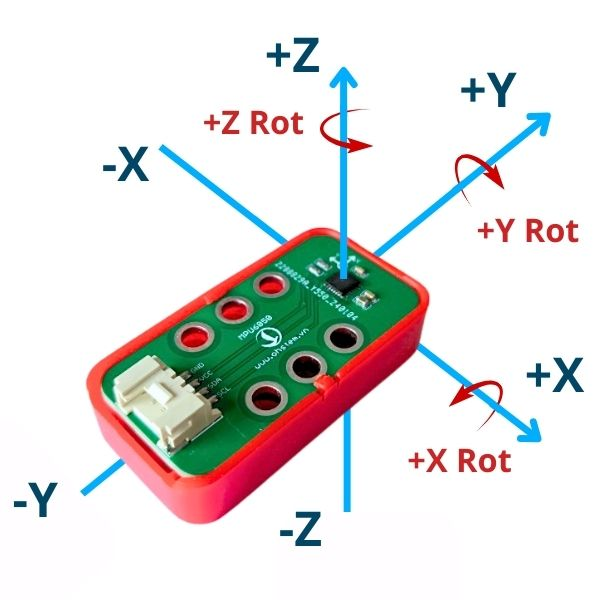
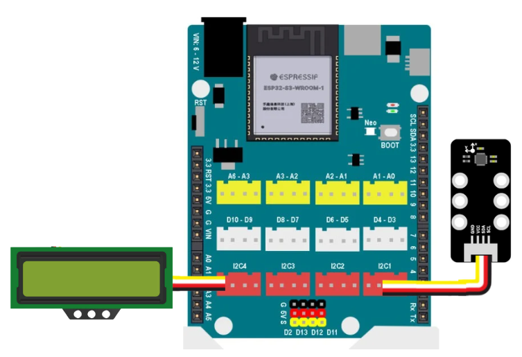
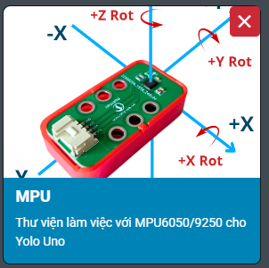
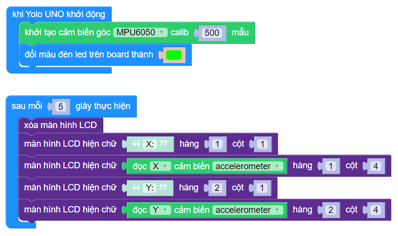

3. Cảm biến góc MPU6050
==========

|

Cảm biến gia tốc MPU6050 là một trong những module phổ biến được sử dụng để đo gia tốc trong các ứng dụng. Với khả năng đo chính xác và tích hợp các cảm biến gia tốc và con quay hồi chuyển trong cùng một chip, MPU6050 đã trở thành một lựa chọn hàng đầu cho các dự án liên quan đến điều khiển chuyển động, robot học tập, hệ thống định vị và nhiều ứng dụng khác. 

Cảm biến gia tốc GY-521 6DOF IMU MPU6050 được sử dụng để đo 6 thông số: 3 trục Góc quay (Gyro), 3 trục gia tốc hướng (Accelerometer), là loại cảm biến gia tốc phổ biến nhất trên thị trường hiện nay. Cảm biến thường được ứng dụng trên các mô hình con lắc động, xe tự cân bằng, máy bay,… 

|

1. Mua sản phẩm
-----------
----------

..  image:: images/gio.png
    :alt: some image
    :target: https://ohstem.vn/product/cam-bien-gia-toc-mpu6050/
    :class: with-shadow
    :scale: 100%
    :align: center
|

2. Thông số kỹ thuật
---------
----------

- Điện áp sử dụng: 3~5VDC
- Điện áp giao tiếp: 3~5VDC
- Chuẩn giao tiếp: I2C
- Giá trị Gyroscopes trong khoảng: +/- 250 500 1000 2000 degree/sec
- Giá trị Acceleration trong khoảng: +/- 2g, +/- 4g, +/- 8g, +/- 16g

3. Kết nối
------------
------------

- **Bước 1**: Chuẩn bị các thiết bị như sau: 

.. list-table:: 
   :widths: auto
   :header-rows: 1
     
   * - .. image:: images/yolo_uno.png
          :width: 200px
          :align: center
     - .. image:: images/3.1.jpg
          :align: center
     - .. image:: images/lcd_1602.png
          :width: 200px
          :align: center
   * - Mạch lập trình Yolo UNO
     - Cảm biến (kèm dây Grove)
     - Màn hình LCD 1602 (kèm dây Grove)
   * - `Mua sản phẩm <https://ohstem.vn/product/yolo-uno/>`_
     - `Mua sản phẩm <https://ohstem.vn/product/cam-bien-gia-toc-mpu6050/>`_
     - `Mua sản phẩm <https://ohstem.vn/product/man-hinh-lcd-1602/>`_

- **Bước 2**: Sử dụng dây Grove cắm vào cảm biến
- **Bước 3**: Kết nối cảm biến và màn hình LCD với **chân I2C trên Yolo UNO**.

    Cảm biến góc MPU6050 kết nối với Yolo UNO thông qua giao thức I2C
|

4. Hướng dẫn lập trình
------------
------------

1. Tải thư viện **MPU6050**  

|

Các khối lệnh sau để làm việc với cảm biến:

|

**Lưu ý:** Cần khởi tạo trước và tiến hành tính toán (calib) 1 số mẫu trước để việc đo góc chính xác hơn.

2. Chúng ta có thể hiển thị góc đo được so với ban đầu thông qua LCD bằng chương trình mẫu sau:

|

**Link chương trình mẫu:** `<https://app.ohstem.vn/#!/share/yolouno/2fu3TC2GYvJAUPmBWh48GhlChr8>`_