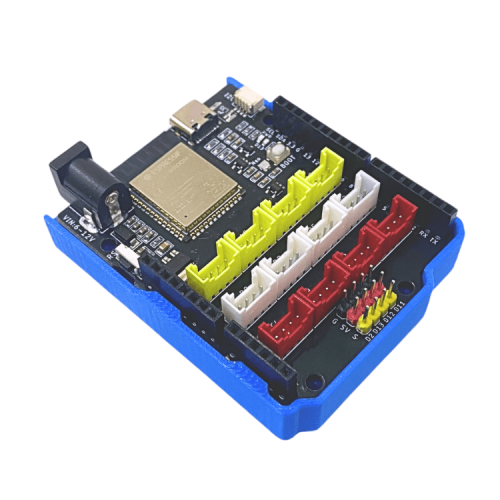

2. Bật/Tắt đèn với nút nhấn đôi
===============

1. Mục tiêu
-----
--------

Trong nội dung này, bạn sẽ biết cách kết nối và lập trình để điều khiển **đèn 4 LED RGB** bằng **nút nhấn đôi** trên mạch Yolo UNO. Khi nhấn nút, đèn sẽ bật/tắt theo yêu cầu, giúp bạn hiểu rõ hơn về cách xử lý tín hiệu từ nút nhấn và điều khiển thiết bị đầu ra. Đây là bước quan trọng để xây dựng các hệ thống điều khiển trong mô hình nhà thông minh.

2. Thiết bị cần sử dụng
---------
----------

- Mạch Yolo UNO:

|

- Module led RGB kèm dây tín hiệu: 

..  image:: images/tiny_rgb.png
    :scale: 50%
    :align: center 
|

- Module nút nhấn đôi kèm dây tín hiệu:

|

3. Kết nối phần cứng
-------
--------

- Kết nối module Led RGB vào chân D9 - D10 của Yolo UNO

- Kết nối module Nút nhấn đôi vào chân D5 - D6 của Yolo UNO

|

4. Chương trình lập trình
------
------

- Câu lệnh dùng để làm việc với nút nhấn đôi, nằm trong mục **CẢM BIẾN**

|

- Câu lệnh dùng để làm việc với đèn 4 LED RGB, nằm trong mục **HIỂN THỊ**

|

- **Chương trình lập trình:**

..  figure:: images/2.4.png
    :scale: 80%
    :align: center 

    `<https://app.ohstem.vn/#!/share/yolouno/2vFUcMKB8BO7kvw6DJJOlYPskQr>`_

- **Giải thích chương trình:**  Sau khi thực hiện gửi chương trình lên Yolo UNO, đèn LED trên Yolo UNO sẽ chuyển sang đèn xanh. Khi nhấn nút A, đèn LED RGB sẽ chuyển sang màu đỏ. Khi nhấn nút B, đèn RGB tắt đèn. 

