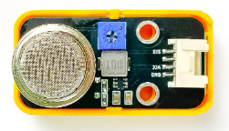

7. Cảnh báo khí gas
============

1. Mục tiêu
-----
--------

Đọc thông tin khí gas từ cảm biến MQ-2, nếu nồng độ khí Gas lên cao thì sẽ phát cảnh báo ra loa.

2. Thiết bị cần sử dụng
---------
----------

- Mạch Yolo UNO:

..  image:: images/yolo_uno.png
    :scale: 60%
    :align: center 
|

- Module SoundPlayer (D3-D4): 

|

- Cảm biến nồng độ khí Gas MQ-2 (A1):

|

3. Kết nối phần cứng
-------
--------

|

4. Chương trình lập trình
------
------

- **Giới thiệu khối lệnh:**

|
    
Các khối lệnh để khai báo cảm biến khí Gas ở chân A1.

|
    
Các khối lệnh để khai báo loa chân D3-D4

- **Chương trình lập trình:**

|
