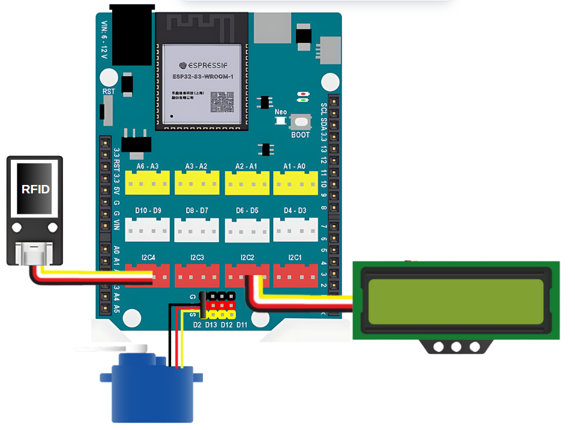

6. Cửa thông minh đóng mở bằng thẻ từ
=========

1. Mục tiêu
-----
--------

Với hướng dẫn này, chúng ta thực hiện tính năng mở khóa cửa bằng thẻ từ, sử dụng module RFID I2C

2. Thiết bị cần sử dụng
---------
----------

- Mạch Yolo UNO:

..  image:: images/yolo_uno.png
    :scale: 60%
    :align: center 
|

- Module LCD kèm dây tín hiệu: 

..  image:: images/lcd_1602.png
    :scale: 50%
    :align: center 
|

- Module RFID kèm dây tín hiệu:

|

- Động cơ servo:

|

3. Kết nối phần cứng
-------
--------

- Kết nối động cơ servo vào cổng D2

- Kết nối LCD vào cổng I2C2

- Kết nối RFID vào cổng I2C4 

|

4. Chương trình lập trình
------
------

- **Tải thư viện RFID**: 

    Vào mục **Mở rộng** và dán link sau vào ô tìm kiếm: `<https://github.com/AITT-VN/yolouno_extension_rfid_i2c>`_

    Xem hướng dẫn tải thư viện `tại đây <https://docs.ohstem.vn/en/latest/module/thu-vien-yolouno.html>`_.

|

- Các khối lệnh để làm việc với module RFID được hiển thị như sau: 

|

- **Chương trình lập trình:**

    `<https://app.ohstem.vn/#!/share/yolouno/2vFcMbi8tdwEh4E3adAmHQJIPiX>`_

- **Giải thích chương trình:**

    - Thêm thẻ từ được phép mở cửa bằng cách đặt thẻ vào module RFID và nhấn nút Boot, RFID sẽ quét và thêm thẻ vào danh sách “1”, quá trình thêm thẻ sẽ lặp lại cho đến khi kiểm tra thẻ trong danh sách trả về giá trị đúng, sau khi thành công nó sẽ hiện ra màn hình LCD chữ ‘“Success!” trong vòng 1 giây.
    
    - Mỗi khi quét thẻ, chương trình sẽ kiểm tra xem thẻ có nằm trong danh sách không, nếu có nó sẽ mở cửa và hiện ra chữ “Welcome!” trong vòng 1 giây.
