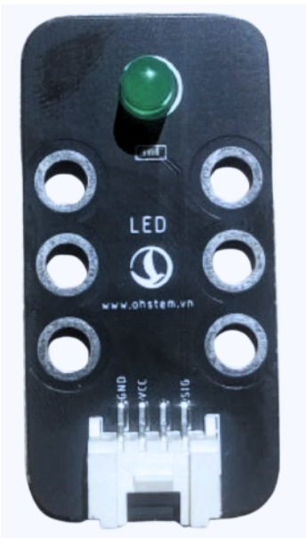
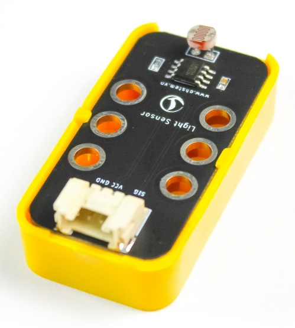
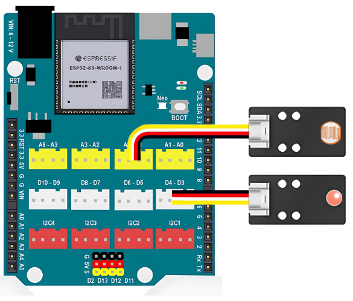
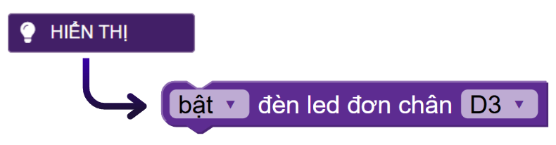
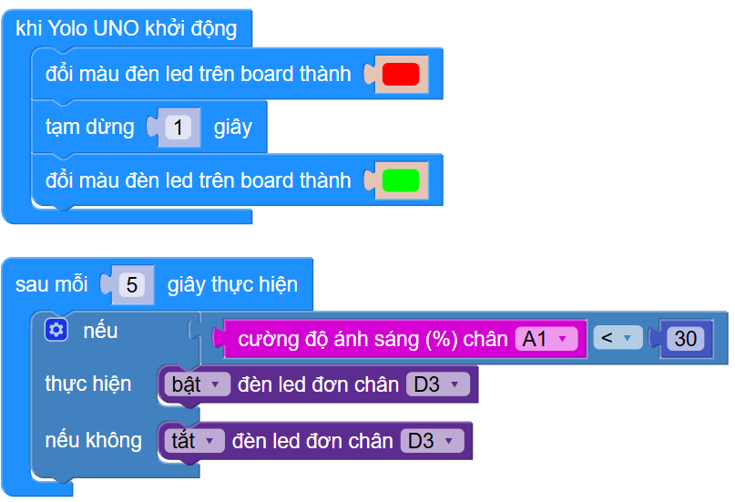

3. Đèn thông minh
======

1. Mục tiêu
-----
--------

Chúng ta hãy cùng lập trình một chiếc đèn thông minh, có thể bật tắt tự động dựa vào ánh sáng nhé. Cụ thể, khi trời tối (độ sáng < 30%) thì đèn sẽ tự bật. Ngược lại, khi trời sáng thì đèn sẽ tự tắt.

2. Thiết bị cần sử dụng
---------
----------

- Mạch Yolo UNO:

..  image:: images/yolo_uno.png
    :scale: 60%
    :align: center 
|

- Đèn LED đơn kèm dây tín hiệu: 

|

- Màn hình LCD kèm dây tín hiệu:

|

3. Kết nối phần cứng
-------
--------

- Module LED đơn kết nối vào cổng D3 - D4

- Module cảm biến ánh sáng kết nối vào cổng A1 - A2

4. Chương trình lập trình
------
------

- Câu lệnh điều kiện, khối lệnh nằm trong mục **LOGIC**:

..  image:: images/den_thong_minh_2.png
    :scale: 90%
    :align: center 
|
    
- Câu lệnh đọc kết quả của cảm biến ánh sáng, nằm trong mục **CẢM BIẾN**:: 

..  image:: images/den_thong_minh_3.png
    :scale: 80%
    :align: center    
|

- Câu lệnh đọc bắt đèn đèn LED đơn, nằm trong mục **HIỂN THỊ**:: 

|

- **Chương trình lập trình:**

    `<https://app.ohstem.vn/#!/share/yolouno/2vFWXwvS5PbkhKooSzyJ0qrIkU8>`_

- **Giải thích chương trình:**  Sau khi thực hiện gửi chương trình lên Yolo UNO, đèn LED trên Yolo UNO sẽ chuyển sang đèn xanh. Hãy thử dùng tay che cảm biến ánh sáng, đèn LED sẽ sáng. 